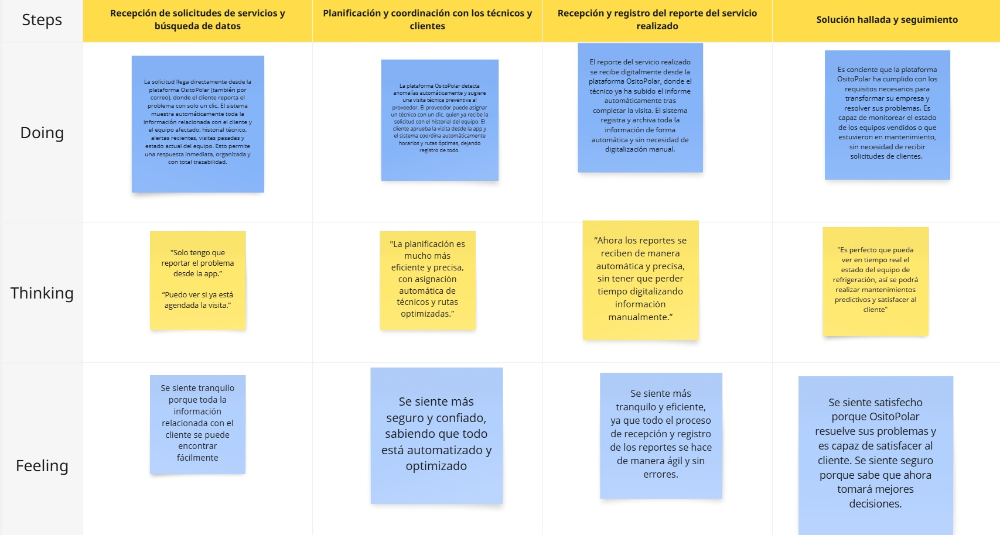

## Capítulo III: Requirements Specification 

### 3.1. To-Be Scenario Mapping.
**Segmento objetivo #1: CLIENTES (DUEÑOS DE EQUIPOS DE REFRIGERACIÓN)**

**Segmento objetivo #2: EMPRESAS PROVEEDORAS DE SERVICIOS Y EQUIPOS DE REFRIGERACIÓN**

### 3.2. User Stories.

Las historias de usuario desarrolladas en este proyecto fueron elaboradas en conjunto por el equipo de desarrollo de OsitoPolar, considerando las necesidades y funcionalidades clave tanto para los clientes (dueños de equipos de refrigeración) como para los empresarios (proveedores de equipos y servicios de mantenimiento y refrigeración). Las historias fueron organizadas bajo épicas que agrupan funcionalidades similares. Los criterios de aceptación de todas las historias siguen la sintaxis Gherkin.
El trabajo fue realizado de manera colaborativa, priorizando la comprensión del problema desde la perspectiva del usuario final. Para facilitar la organización, priorización y trazabilidad de las tareas, se utilizó la plataforma Trello

| **Epic / Story ID** | **Título**                                                              | **Descripción**                                                                                                                                                                                                                                                                                        | **Criterios de Aceptación**                                                                                                                                                                                                                                                                                                                                                                                                                                                                                                                                                                                                                                                                                                                                                                                                                                                             | **Relacionado con (Epic ID)** |
|---------------------|-------------------------------------------------------------------------|--------------------------------------------------------------------------------------------------------------------------------------------------------------------------------------------------------------------------------------------------------------------------------------------------------|-----------------------------------------------------------------------------------------------------------------------------------------------------------------------------------------------------------------------------------------------------------------------------------------------------------------------------------------------------------------------------------------------------------------------------------------------------------------------------------------------------------------------------------------------------------------------------------------------------------------------------------------------------------------------------------------------------------------------------------------------------------------------------------------------------------------------------------------------------------------------------------------|-------------------------------|
| US-01               | Registro de usuario                                                     | Como nuevo usuario, quiero registrarme para acceder a la plataforma y empezar a gestionar mis equipos de refrigeración                                                                                                                                                                                 | **Escenario 1: Crear cuenta exitosamente**   Dado que el nuevo usuario tiene todos los datos correctos, cuando completa el registro, entonces su cuenta es creada correctamente.  **Escenario 2: Intento de crear cuenta con email ya registrado**  Dado que el nuevo usuario intenta registrarse con un correo ya registrado, cuando envía el formulario, entonces el sistema muestra un mensaje indicando que el correo ya existe.                                                                                                                                                                                                                                                                                                                                                                                                                                        | EP-01                         |
| US-02               | Inicio de sesión                                                        | Como usuario, quiero acceder a mi cuenta en la plataforma para utilizar sus funcionalidades.                                                                                                                                                                                                           | **Escenario 1: Iniciar sesión correctamente**   Dado que el usuario tiene una cuenta activa, cuando ingresa sus datos correctamente, entonces accede a su panel de control.  **Escenario 2: Intento de iniciar sesión con datos incorrectos**  Dado que el usuario ingresa datos incorrectos, cuando intenta iniciar sesión, entonces el sistema muestra un mensaje de error.                                                                                                                                                                                                                                                                                                                                                                                                                                                                                               | EP-01                         |
| US-03               | Solicitar y programar un tipo de servicio para mis equipos              | Como cliente, quiero seleccionar el tipo de servicio que necesito (reparación, mantenimiento, diagnóstico, etc.) y programar su fecha y hora, para gestionar eficazmente el soporte de mis equipos de refrigeración.                                                                                   | **Escenario 1: Iniciar solicitud de servicio y seleccionar tipo** Dado que he identificado una necesidad para mi equipo, cuando accedo a la opción de "Solicitar Servicio", entonces se me presenta una lista de tipos de servicio disponibles (ej., "Reparación", "Mantenimiento Preventivo", "Diagnóstico", "Instalación") para que elija. **Escenario 2: Programar fecha y hora del servicio** Dado que he seleccionado el tipo de servicio, cuando procedo a programarlo, entonces se me permite elegir una fecha y una franja horaria disponibles para la intervención. **Escenario 3: Confirmación de la solicitud programada** Dado que he completado la selección del tipo de servicio y la programación, cuando envío la solicitud, entonces el sistema me muestra un mensaje de confirmación con todos los detalles del servicio solicitado y programado. | EP-03                         |
| US-04               | Ver estado del servicio solicitado                                      | Como cliente, quiero ver el estado actual de mi solicitud de servicio para estar informado sobre el avance del proceso.                                                                                                                                                                                | **Escenario 1: Verificación del estado de la solicitud**   Dado que el cliente ha solicitado el servicio, cuando ingresa a la plataforma, entonces puede ver el estado actualizado de su solicitud.  **Escenario 2: Actualización de estado en tiempo real**  Dado que el cliente está visualizando su solicitud, cuando el técnico inicia el trabajo, entonces el estado se actualiza.                                                                                                                                                                                                                                                                                                                                                                                                                                                                                     | EP-03                         |
| US-05               | Ver reporte de servicio realizado                                       | Como cliente, quiero ver el reporte de servicio detallado para saber qué reparaciones se hicieron en mi equipo.                                                                                                                                                                                        | **Escenario 1: Generación del reporte de servicio**  Dado que el servicio ha sido completado, cuando el técnico termina, entonces el sistema genera un reporte detallado.  **Escenario 2: Enviar reporte al cliente por correo** Dado que el reporte ha sido generado, cuando se ha finalizado el servicio, entonces el sistema envía el reporte al cliente por correo electrónico.                                                                                                                                                                                                                                                                                                                                                                                                                                                                                             | EP-04                         |
| US-06               | Agregar equipos                                                         | Como cliente, quiero agregar mis equipos de refrigeración en la plataforma para llevar un control.                                                                                                                                                                                                     | **Escenario 1: Agregar equipo de refrigeración** Dado que el cliente quiere agregar un equipo, cuando ingresa los detalles del equipo, entonces el sistema lo registra correctamente.  **Escenario 2: Editar información del equipo**   Dado que el cliente desea editar la información del equipo, cuando realiza los cambios, entonces el sistema actualiza la información del equipo.                                                                                                                                                                                                                                                                                                                                                                                                                                                                                    | EP-02                         |
| US-07               | Recibir alerta de falla en equipo                                       | Como cliente, quiero recibir una alerta automática cuando mi equipo de refrigeración presente una falla para tomar acción rápidamente.                                                                                                                                                                 | **Escenario 1: Alerta de falla detectada**   Dado que el equipo de refrigeración está funcionando mal, cuando se detecta una falla, entonces el sistema envía una alerta al cliente.  **Escenario 2: Alerta de mantenimiento preventivo** Dado que el equipo está funcionando correctamente, cuando el sistema detecta una necesidad de mantenimiento preventivo, entonces envía una alerta preventiva al cliente.                                                                                                                                                                                                                                                                                                                                                                                                                                                              | EP-05                         |
| US-08               | Ver la ubicación de cada equipo                                         | Como cliente o técnico, quiero poder visualizar la ubicación exacta de cada uno de mis equipos de refrigeración en la plataforma, para una gestión geográfica eficiente y una respuesta rápida en caso de incidentes.                                                                                  | **Escenario 1: Visualización de ubicación en la lista de equipos** Dado que estoy en la sección de "Mis Equipos", cuando selecciono un equipo específico, entonces puedo ver su dirección o coordenadas geográficas. **Escenario 2: Visualización de ubicación en un mapa** Dado que estoy viendo los detalles de un equipo, cuando accedo a la opción de "Ver en Mapa", entonces se me muestra la ubicación del equipo marcada en un mapa interactivo. **Escenario 3: Búsqueda de equipos por ubicación** Dado que necesito encontrar equipos en una zona específica, cuando utilizo la función de búsqueda por ubicación, entonces el sistema filtra y me muestra los equipos dentro de esa área.                                                                                                                                                                 | EP-02                         |
| US-09               | Ver consumo energético de equipos                                       | Como cliente, quiero ver un informe del consumo energético de mis equipos para analizar su eficiencia.                                                                                                                                                                                                 | **Escenario 1: Visualización de consumo energético**  Dado que el cliente tiene equipos registrados, cuando ingresa a la plataforma, entonces puede ver el informe de consumo energético de cada equipo.  **Escenario 2: Comparación del consumo energético**   Dado que el cliente quiere comparar, cuando selecciona dos equipos, entonces el sistema genera una comparación de su consumo energético.                                                                                                                                                                                                                                                                                                                                                                                                                                                                    | EP-04                         |
| US-10               | Recepción de alertas automáticas para servicio                          | Como empresario, quiero recibir alertas automáticas cuando un cliente solicite un servicio de reparación o mantenimiento para brindar el servicio inmediatamente.                                                                                                                                      | **Escenario 1: Recepción de solicitud de servicio** Dado que el cliente ha solicitado un servicio, cuando se recibe la solicitud, entonces el sistema envía una alerta al empresario.  **Escenario 2: Alerta de mantenimiento preventivo solicitado**  Dado que un cliente ha solicitado mantenimiento preventivo, cuando se registra la solicitud, entonces el sistema envía una alerta automática al empresario.                                                                                                                                                                                                                                                                                                                                                                                                                                                          | EP-05                         |
| US-11               | Asignar técnico a solicitud de servicio                                 | Como empresario, quiero asignar un técnico a una solicitud de servicio para garantizar que se realice el trabajo adecuado.                                                                                                                                                                             | **Escenario 1: Asignar técnico a servicio** Escenario 1: Dado que el empresario recibe una solicitud de servicio, cuando elige un técnico, entonces el sistema asigna al técnico seleccionado a la solicitud.  **Escenario 2: Confirmación de asignación de técnico** Dado que el técnico ha sido asignado, cuando el empresario lo confirma, entonces el sistema envía una notificación al técnico con los detalles.                                                                                                                                                                                                                                                                                                                                                                                                                                                       | EP-03                         |
| US-12               | Ver historial de servicios realizados                                   | Como empresario, quiero ver el historial de servicios realizados para cada cliente y equipo, para llevar un control adecuado.                                                                                                                                                                          | **Escenario 1: Visualizar historial de servicios**  Dado que el empresario tiene acceso al historial de servicios, cuando accede a la plataforma, entonces puede ver el historial completo de servicios realizados.  **Escenario 2: Filtrar historial por cliente o equipo** Dado que el empresario quiere filtrar los servicios, cuando selecciona un cliente o equipo, entonces el sistema filtra los servicios realizados según el filtro seleccionado                                                                                                                                                                                                                                                                                                                                                                                                                   | EP-04                         |
| US-13               | Realizar seguimiento a solicitudes de servicio                          | Como empresario, quiero realizar un seguimiento detallado a las solicitudes de servicio de mis técnicos, para saber cómo van.                                                                                                                                                                          | **Escenario 1: Ver estado de la solicitud de servicio**  Dado que el empresario tiene acceso a solicitudes, cuando ingresa al sistema, entonces puede ver el estado actualizado de cada solicitud de servicio.  **Escenario 2: Actualización del estado de la solicitud** Dado que el empresario quiere seguir el progreso, cuando un técnico actualiza el estado de la solicitud, entonces el sistema muestra el estado en tiempo real.                                                                                                                                                                                                                                                                                                                                                                                                                                    | EP-03                         |
| US-14               | Generar reporte de desempeño de técnicos                                | Como empresario, quiero generar reportes sobre el desempeño de mis técnicos para evaluar su eficiencia y productividad.                                                                                                                                                                                | **Escenario 1: Generar reporte de desempeño**  Dado que el empresario quiere evaluar el desempeño de sus técnicos, cuando selecciona la opción de generar reporte, entonces el sistema crea un informe con los datos.  ** Escenario 2: Descargar reporte de desempeño** Dado que el reporte ha sido generado, cuando el empresario quiere descargarlo, entonces el sistema permite descargar el archivo en formato PDF.                                                                                                                                                                                                                                                                                                                                                                                                                                                     | EP-04                         |
| US-15               | Configurar alertas de mantenimiento                                     | Como empresario, quiero configurar alertas automáticas para el mantenimiento preventivo de los equipos.                                                                                                                                                                                                | **Escenario 1: Configuración de alerta de mantenimiento**  Dado que el empresario quiere configurar alertas, cuando ingresa los parámetros, entonces el sistema configura la alerta correctamente.  **Escenario 2: Modificación de alerta configurada**  Dado que el empresario ha configurado una alerta, cuando decide cambiar la frecuencia, entonces el sistema actualiza la alerta.                                                                                                                                                                                                                                                                                                                                                                                                                                                                                    | EP-05                         |
| US-16               | Visualizar clientes y servicios asociados                               | Como empresario, quiero ver todos los clientes que han solicitado servicio para organizar el trabajo de los técnicos.                                                                                                                                                                                  | **Escenario 1: Ver clientes y servicios asociados** Dado que el empresario quiere visualizar la información, cuando accede a la funcionalidad correspondiente, entonces puede consultar los clientes con sus servicios relacionados. **Escenario 2: Filtrar por estado de servicio** Dado que el empresario necesita filtrar resultados, cuando aplica el filtro por estado, entonces el sistema muestra los datos correspondientes.                                                                                                                                                                                                                                                                                                                                                                                                                                        | EP-04                         |
| US-17               | Visualizar equipos entregados a clientes                                | Como empresario, quiero ver todos los equipos que fueron entregados a clientes para realizar su seguimiento.                                                                                                                                                                                           | **Escenario 1: Ver equipos asociados** Dado que el empresario quiere visualizar la información de equipos, cuando accede al listado de equipos, entonces puede consultar los que están asociados a clientes. **Escenario 2: Filtrar por estado y tipo de equipo** Dado que el empresario necesita filtrar los resultados, cuando aplica los criterios, entonces el sistema muestra los equipos correspondientes.                                                                                                                                                                                                                                                                                                                                                                                                                                                            | EP-02                         |
| US-18               | Recibir notificaciones de eventos importantes                           | Como cliente, quiero recibir notificaciones sobre eventos importantes como el progreso del servicio para mantenerme informado.                                                                                                                                                                         | **Escenario 1: Problema reportado durante el servicio** Dado que el técnico detecta una complicación o requiere aprobación, cuando se genera un evento interno, entonces el sistema envía una notificación que requiere acción del cliente. **Escenario 2: Notificación sobre progreso del servicio** Dado que el servicio está en ejecución, cuando el estado cambia, entonces se envía una notificación al cliente.                                                                                                                                                                                                                                                                                                                                                                                                                                                       | EP-05                         |
| US-19               | Realizar evaluación de servicio                                         | Como cliente, quiero evaluar el servicio para mostrar mi conformidad.                                                                                                                                                                                                                                  | **Escenario 1: Evaluar el servicio una vez finalizado** Dado que el cliente ha recibido el servicio, cuando accede a la opción de evaluación, entonces puede registrar una calificación del 1 al 5. **Escenario 2: Corrección de evaluación del servicio** Dado que el cliente ya evaluó el servicio, cuando realiza una modificación dentro del plazo permitido, entonces el sistema actualiza la calificación registrada.                                                                                                                                                                                                                                                                                                                                                                                                                                                 | EP-06                         |
| US-20               | Registrar técnicos                                                      | Como empresario, quiero registrar técnicos en la plataforma para integrarlos a mi red de soporte técnico.                                                                                                                                                                                              | **Escenario 1: Registro exitoso de un técnico** Dado que el empresario desea registrar un técnico, cuando completa los datos requeridos y confirma, entonces el sistema lo registra correctamente. **Escenario 2: Intento de registro con datos incompletos** Dado que faltan datos obligatorios, cuando intenta registrar al técnico, entonces el sistema impide la operación hasta que se completen los campos necesarios.                                                                                                                                                                                                                                                                                                                                                                                                                                                | EP-01                         |
| US-21               | Visualizar perfil del técnico                                           | Como empresario, quiero visualizar el perfil de cada técnico, incluyendo sus datos personales y métricas de desempeño, para evaluar su rendimiento.                                                                                                                                                    | **Escenario 1: Acceso a información completa del técnico** Dado que el empresario selecciona un técnico, cuando accede a su información, entonces puede consultar datos personales, historial de servicios y calificaciones. **Escenario 2: Técnico sin evaluaciones registradas** Dado que el técnico aún no ha sido evaluado, cuando se consulta su perfil, entonces no se muestran métricas de desempeño.                                                                                                                                                                                                                                                                                                                                                                                                                                                                | EP-01                         |
| US-22               | Recibir alertas de fallas en equipos                                    | Como empresario, quiero recibir alertas cuando alguno de los equipos de mis clientes presenta fallas, para notificar al cliente y organizar atención.                                                                                                                                                  | **Escenario 1: Recepción de alerta automática por sensor** Dado que un equipo monitoreado presenta una falla, cuando el sistema la detecta, entonces genera una alerta inmediata para el empresario. **Escenario 2: Comunicación con el cliente** Dado que el empresario ha recibido una alerta, cuando revisa el equipo afectado, entonces puede iniciar una notificación directa al cliente desde la plataforma.                                                                                                                                                                                                                                                                                                                                                                                                                                                          | EP-05                         |
| US-23               | Visualizar propuesta de valor principal                                 | Como visitante, quiero conocer la propuesta de valor de OsitoPolar, para entender si la plataforma se ajusta a mis necesidades.                                                                                                                                                                        | **Escenario 1: Propuesta visible al ingresar** Dado que estoy en la página oficial de OsitoPolar, cuando la página carga, entonces debo acceder inmediatamente a una frase que explique claramente la propuesta de valor. **Escenario 2: Propuesta orientada a gestión de refrigeración** Dado que soy un visitante del segmento 1, cuando reviso la propuesta de valor, entonces esta debe mencionar conceptos relacionados con gestión inteligente y monitoreo de equipos.                                                                                                                                                                                                                                                                                                                                                                                                | EP-07                         |
| US-24               | Explorar soluciones específicas para mi rubro                           | Como visitante, quiero conocer las soluciones específicas que ofrece OsitoPolar para mi tipo de negocio, para saber si se ajusta a mis necesidades.                                                                                                                                                    | **Escenario 1: Acceso a información para negocios** Dado que accedo a las soluciones ofrecidas, cuando reviso el contenido disponible, entonces debo encontrar descripciones específicas dirigidas a negocios que utilizan o gestionan equipos de refrigeración. **Escenario 2: Acceso a información para empresas proveedoras** Dado que accedo a las soluciones ofrecidas, cuando reviso el contenido disponible, entonces debo encontrar información específica para empresas proveedoras de equipos o servicios de mantenimiento.                                                                                                                                                                                                                                                                                                                                       | EP-07                         |
| US-25               | Comprender funcionalidades destacadas                                   | Como visitante, quiero comprender las funcionalidades clave de la plataforma, para evaluar si se adapta a mi operación.                                                                                                                                                                                | **Escenario 1: Acceso a funcionalidades principales** Dado que consulto las características de la plataforma, cuando reviso la lista de funcionalidades, entonces debo identificar opciones clave como monitoreo en tiempo real, automatización de alertas y gestión remota. **Escenario 2: Descripciones orientadas a valor** Dado que leo las descripciones de las funcionalidades, cuando evalúo cada una, entonces debo entender el beneficio que aporta para operaciones de refrigeración o mantenimiento.                                                                                                                                                                                                                                                                                                                                                             | EP-07                         |
| US-26               | Solicitar una demo fácilmente                                           | Como visitante, quiero solicitar una demo de la plataforma, para iniciar contacto con OsitoPolar.                                                                                                                                                                                                      | **Escenario 1: Disponibilidad de opción para solicitar demo** Dado que estoy explorando la plataforma, cuando busco cómo solicitar una demostración, entonces debo encontrar una opción clara y accesible para iniciar el proceso. **Escenario 2: Acceso a canal de contacto** Dado que selecciono la opción de solicitar una demo, cuando soy redirigido, entonces debo acceder a un canal funcional de contacto como un formulario, correo electrónico o enlace directo.                                                                                                                                                                                                                                                                                                                                                                                                  | EP-07                         |
| US-27               | Conocer misión y visión de la startup                                   | Como visitante, quiero conocer la misión y visión de OsitoPolar, para entender su enfoque y propuesta de valor.                                                                                                                                                                                        | **Escenario 1: Acceso a la misión de la empresa** Dado que accedo a la información institucional de OsitoPolar, cuando reviso su contenido corporativo, entonces debo encontrar una descripción clara de su misión. **Escenario 2: Acceso a la visión de la empresa** Dado que accedo a la información institucional, cuando reviso su contenido estratégico, entonces debo encontrar una descripción clara de su visión a futuro.                                                                                                                                                                                                                                                                                                                                                                                                                                          | EP-07                         |
| US-28               | Contactar fácilmente con ventas                                         | Como visitante empresario, quiero contactar fácilmente con el equipo de ventas, para iniciar una posible relación comercial.                                                                                                                                                                           | **Escenario 1: Disponibilidad de medio de contacto comercial** Dado que estoy interesado en contactar al equipo de ventas, cuando busco información de contacto, entonces debo encontrar una opción clara para iniciar la comunicación. **Escenario 2: Redirección al canal adecuado** Dado que selecciono la opción de contacto, cuando soy redirigido, entonces debo llegar a un canal funcional como un formulario, dirección de correo o número de contacto.                                                                                                                                                                                                                                                                                                                                                                                                            | EP-07                         |
| US-29               | Acceder fácilmente a la plataforma                                      | Como visitante, quiero acceder fácilmente al inicio de sesión, para ingresar rápidamente a mi cuenta.                                                                                                                                                                                                  | **Escenario 1: Acceso al inicio de sesión** Dado que soy un usuario registrado, cuando busco cómo ingresar a mi cuenta, entonces debo encontrar una opción claramente identificable para iniciar sesión. **Escenario 2: Redirección al formulario de autenticación** Dado que selecciono la opción de inicio de sesión, cuando soy redirigido, entonces debo llegar al formulario correspondiente para ingresar mis credenciales.                                                                                                                                                                                                                                                                                                                                                                                                                                           | EP-07                         |
| US-30               | Descargar la app móvil desde la web                                     | Como visitante interesado en usar OsitoPolar desde el celular, quiero descargar fácilmente la app móvil, para instalarla y comenzar a usarla.                                                                                                                                                          | **Escenario 1: Acceso a opciones de descarga móvil** Dado que estoy interesado en utilizar la aplicación en mi celular, cuando exploro la plataforma, entonces debo encontrar un enlace o referencia a la descarga de la app móvil. **Escenario 2: Redirección a la tienda correspondiente** Dado que selecciono el enlace de descarga, cuando soy redirigido, entonces debo acceder a la tienda de aplicaciones correspondiente según mi sistema operativo.                                                                                                                                                                                                                                                                                                                                                                                                                | EP-07                         |
| US-31               | Controlar encendido y apagado del equipo                                | Como cliente, quiero poder encender y apagar remotamente mis equipos de refrigeración desde la plataforma, para tener un mayor control operativo.                                                                                                                                                      | **Escenario 1: Encendido remoto del equipo** Dado que el cliente tiene un equipo registrado, cuando ejecuta una acción de encendido sobre el equipo, entonces el sistema transmite la instrucción y cambia el estado del equipo a encendido. **Escenario 2: Apagado remoto del equipo** Dado que el cliente tiene un equipo activo, cuando ejecuta una acción de apagado, entonces el sistema transmite la instrucción y cambia el estado del equipo a apagado.                                                                                                                                                                                                                                                                                                                                                                                                             | EP-02                         |
| US-32               | Ajustar temperatura del equipo                                          | Como cliente, quiero ajustar la temperatura de mis equipos de refrigeración desde la plataforma, para mantener condiciones óptimas según mi operación.                                                                                                                                                 | **Escenario 1: Aumentar temperatura** Dado que el cliente tiene acceso a un equipo, cuando incrementa el valor de temperatura deseada, entonces el sistema actualiza la configuración del equipo con el nuevo valor. **Escenario 2: Disminuir temperatura** Dado que el cliente tiene acceso a un equipo, cuando reduce el valor de temperatura deseada, entonces el sistema actualiza la configuración del equipo con el nuevo valor.                                                                                                                                                                                                                                                                                                                                                                                                                                      | EP-02                         |
| US-33               | Gestionar mi suscripción                                                | Como cliente, quiero poder ver los detalles de mi plan de suscripción actual y tener la opción de actualizarlo, para poder controlar mis beneficios y acceso a funcionalidades.                                                                                                                        | **Escenario 1: Ver detalles de suscripción** Dado que soy un cliente con una suscripción activa, cuando accedo a la sección de "Mi Suscripción", entonces veo el nombre de mi plan, sus características y la fecha de expiración. **Escenario 2: Iniciar proceso de actualización de plan** Dado que estoy viendo los detalles de mi suscripción, cuando selecciono la opción "Actualizar Plan", entonces se me presenta una lista de planes disponibles con sus características y precios.                                                                                                                                                                                                                                                                                                                                                                                 | EP-08                         |
| US-34               | Realizar y validar pagos de mi suscripción                              | Como cliente, quiero poder realizar pagos de mi suscripción y que estos pagos se validen correctamente, para asegurar el acceso continuo a los servicios.                                                                                                                                              | **Escenario 1: Pago exitoso de suscripción** Dado que intento pagar mi suscripción, cuando el sistema procesa mi pago y este es exitoso, entonces mi suscripción se activa/renueva y recibo una confirmación. **Escenario 2: Pago fallido** Dado que intento pagar mi suscripción, cuando el pago falla (ej. tarjeta rechazada), entonces recibo un mensaje de error claro y se me indica cómo proceder. **Escenario 3: Verificación de membresía activa** Cuando intento acceder a una funcionalidad premium, entonces el sistema verifica mi membresía y me permite el acceso si está activa.                                                                                                                                                                                                                                                                     | EP-08                         |
| US-35               | Gestionar mi suscripción                                                | Como cliente, quiero ver los detalles de mi plan de suscripción actual y tener la opción de actualizarlo, para controlar mis beneficios y acceso a funcionalidades.                                                                                                                                    | **Escenario 1: Ver detalles de suscripción** Dado que soy un cliente con una suscripción activa, cuando accedo a la sección de "Mi Suscripción", entonces veo el nombre de mi plan, sus características y la fecha de expiración. **Escenario 2: Iniciar proceso de actualización de plan** Dado que estoy viendo los detalles de mi suscripción, cuando selecciono la opción "Actualizar Plan", entonces se me presenta una lista de planes disponibles con sus características y precios.                                                                                                                                                                                                                                                                                                                                                                                 | EP-08                         |
| US-36               | Realizar y validar pagos de mi suscripción                              | Como cliente, quiero realizar pagos de mi suscripción y que estos pagos se validen correctamente, para asegurar el acceso continuo a los servicios.                                                                                                                                                    | **Escenario 1: Pago exitoso de suscripción** Dado que intento pagar mi suscripción, cuando el sistema procesa mi pago y este es exitoso, entonces mi suscripción se activa/renueva y recibo una confirmación. **Escenario 2: Pago fallido** Dado que intento pagar mi suscripción, cuando el pago falla (ej. tarjeta rechazada), entonces recibo un mensaje de error claro y se me indica cómo proceder. **Escenario 3: Verificación de membresía activa** Cuando intento acceder a una funcionalidad premium, entonces el sistema verifica mi membresía y me permite el acceso si está activa.                                                                                                                                                                                                                                                                     | EP-08                         |
| US-37               | Cambiar el idioma de la plataforma a inglés                             | Como usuario, quiero poder cambiar el idioma de la plataforma a inglés, para utilizar la aplicación en mi idioma preferido.                                                                                                                                                                            | **Escenario 1: Selección de idioma inglés** Dado que estoy en la configuración de mi perfil o en el menú de idioma, cuando selecciono "English", entonces la interfaz de usuario, incluyendo textos, etiquetas y mensajes, cambia a inglés. **Escenario 2: Persistencia del idioma seleccionado** Dado que he cambiado el idioma a inglés, cuando cierro sesión y vuelvo a iniciarla, entonces la plataforma se mantiene en inglés por defecto. **Escenario 3: Contenido en inglés** Dado que el idioma está configurado en inglés, cuando navego por las diferentes secciones de la plataforma, entonces todo el contenido textual (excluyendo datos específicos del usuario o equipo que puedan estar en otro idioma) se muestra en inglés.                                                                                                                       | EP-01                         |
| TS-01               | Registrar nuevo usuario a través de API RESTful                         | Como desarrollador, quiero exponer un endpoint para registrar nuevos usuarios en la plataforma, validando datos, para permitir el acceso seguro de nuevos usuarios.                                                                                                                                    | **Escenario 1: Registro exitoso** Dado que el endpoint `/api/v1/users` está disponible, cuando se envía una solicitud POST con datos válidos (nombre, email único, contraseña válida), entonces el sistema responde con 201 y devuelve el usuario registrado. **Escenario 2: Registro con email existente** Dado un correo ya registrado, cuando se intenta registrar nuevamente, entonces se devuelve un 400 con mensaje "Email already registered".                                                                                                                                                                                                                                                                                                                                                                                                                       | EP-01                         |
| TS-02               | Autenticación de usuarios y técnicos vía API RESTful                    | Como desarrollador, quiero implementar un endpoint para que los usuarios (clientes y técnicos) puedan iniciar sesión de forma segura y obtener un token de autenticación, para permitir el acceso a funcionalidades protegidas.                                                                        | **Escenario 1: Inicio de sesión exitoso** Dado que el endpoint `/api/v1/auth/login` está disponible, cuando se envía una solicitud POST con credenciales válidas (email, contraseña), entonces se recibe una respuesta 200 con un token JWT válido. **Escenario 2: Credenciales inválidas** Dado que se envían credenciales incorrectas, cuando se intenta iniciar sesión, entonces se recibe una respuesta 401 con mensaje "Invalid credentials".                                                                                                                                                                                                                                                                                                                                                                                                                          | EP-01                         |
| TS-03               | Consultar perfil de usuario a través de API RESTful                     | Como desarrollador, quiero exponer un endpoint para que el cliente pueda consultar los detalles de su propio perfil, permitiendo la visualización de sus datos.                                                                                                                                        | **Escenario 1: Consulta exitosa del perfil** Dado que el endpoint `/api/v1/users/{id}` (o `/api/v1/profile` para el usuario autenticado) está disponible, cuando se envía una solicitud GET con un ID de usuario válido y autenticación, entonces se recibe una respuesta 200 con los datos del perfil del usuario (nombre, email, etc.). **Escenario 2: Acceso no autorizado** Dado que un usuario intenta consultar un perfil que no le pertenece sin los permisos adecuados, entonces se recibe una respuesta 403 con mensaje "Unauthorized access".                                                                                                                                                                                                                                                                                                                     | EP-01                         |
| TS-04               | Actualizar información de usuario a través de API RESTful               | Como desarrollador, quiero implementar un endpoint que permita a los clientes actualizar la información de su perfil, para que puedan mantener sus datos personales al día.                                                                                                                            | **Escenario 1: Actualización exitosa del perfil** Dado que el endpoint `/api/v1/users/{id}` (o `/api/v1/profile`) está disponible, cuando se envía una solicitud PUT/PATCH con datos válidos y autenticación, entonces se recibe una respuesta 200 y el perfil del usuario se actualiza. **Escenario 2: Datos inválidos para actualización** Dado que se intenta actualizar con datos mal formateados o inválidos (ej. email duplicado), entonces se recibe una respuesta 400 con mensaje de error específico.                                                                                                                                                                                                                                                                                                                                                              | EP-01                         |
| TS-05               | Registrar nuevo técnico a través de API RESTful                         | Como desarrollador, quiero exponer un endpoint para registrar nuevos técnicos en la plataforma, validando datos para su integración a la red de soporte.                                                                                                                                               | **Escenario 1: Registro exitoso** Dado que el endpoint `/api/v1/technicians` está disponible, cuando se envía una solicitud POST con datos válidos, entonces el sistema responde con 201 y devuelve los datos del técnico registrado. **Escenario 2: Datos incompletos o inválidos** Dado que se envían datos faltantes o incorrectos, cuando se intenta registrar, entonces se recibe una respuesta 400 con mensaje "Invalid or incomplete data".                                                                                                                                                                                                                                                                                                                                                                                                                          | EP-01                         |
| TS-06               | Eliminar técnico asignado a través de API RESTful                       | Como desarrollador, quiero eliminar un técnico del sistema desde el API para gestionar la asignación de servicios y roles técnicos.                                                                                                                                                                    | **Escenario 1: Técnico eliminado correctamente** Dado que el endpoint `/technicians/{id}` está disponible y el ID existe, cuando se hace un DELETE, entonces se devuelve código 204 y el técnico es removido del sistema. **Escenario 2: Intentar eliminar técnico inexistente** Dado que el ID del técnico no existe, cuando se hace un DELETE, entonces se devuelve código 404 con mensaje "Technician not found".                                                                                                                                                                                                                                                                                                                                                                                                                                                        | EP-01                         |
| TS-07               | Consultar perfil del técnico con métricas por API                       | Como desarrollador, quiero crear un endpoint que muestre el perfil completo de un técnico incluyendo datos personales, historial y métricas de desempeño, para su visualización por el empresario.                                                                                                     | **Escenario 1: Visualización del perfil completo** Dado que el endpoint `/api/v1/technicians/{technicianId}` está disponible, cuando se realiza una consulta GET, entonces se devuelve la información personal, servicios realizados y evaluación promedio. **Escenario 2: Técnico sin historial** Dado que el técnico aún no ha realizado servicios, el sistema informa que no hay datos de desempeño aún.                                                                                                                                                                                                                                                                                                                                                                                                                                                                 | EP-01                         |
| TS-08               | Registrar nuevo equipo a través de API RESTful                          | Como desarrollador, quiero exponer un endpoint RESTful que permita registrar nuevos equipos de refrigeración, para facilitar su control y monitoreo desde la plataforma.                                                                                                                               | **Escenario 1: Registro exitoso** Dado que el endpoint `/equipment` está disponible, cuando se envía una solicitud POST con los datos válidos (nombre, tipo, ubicación, etc.), entonces se recibe una respuesta con estado 201 y los datos del equipo registrado. **Escenario 2: Registro con datos inválidos** Dado que el endpoint está disponible, cuando se envía una solicitud POST con campos obligatorios vacíos o mal formateados, entonces se recibe una respuesta 400 con mensaje "Invalid or incomplete data".                                                                                                                                                                                                                                                                                                                                                   | EP-02                         |
| TS-09               | Actualizar información de equipo a través de API RESTful                | Como desarrollador, quiero implementar un endpoint que permita actualizar la información de un equipo de refrigeración existente, para mantener sus detalles al día.                                                                                                                                   | **Escenario 1: Actualización exitosa** Dado que el endpoint `/api/v1/equipments/{id}` está disponible, cuando se envía una solicitud PUT/PATCH con datos válidos para un ID existente, entonces se recibe una respuesta 200 y el equipo se actualiza. **Escenario 2: Equipo no encontrado** Dado que el ID del equipo no existe, cuando se intenta actualizar, entonces se recibe una respuesta 404 con mensaje "Equipment not found".                                                                                                                                                                                                                                                                                                                                                                                                                                      | EP-02                         |
| TS-10               | Consultar equipos por propietario a través de API RESTful               | Como desarrollador, quiero exponer un endpoint para que los clientes puedan consultar la lista de sus equipos registrados a través de su ownerId, permitiendo la visualización de su inventario.                                                                                                       | **Escenario 1: Consulta exitosa de equipos por owner** Dado que el endpoint GET `/api/v1/equipments/owners/{ownerId}` está disponible y autenticado, cuando se envía una solicitud GET con un `{ownerId}` válido, entonces se recibe una respuesta 200 con una lista de equipos asociados al propietario. **Escenario 2: Propietario sin equipos registrados** Dado que el ownerId no tiene equipos registrados, entonces se recibe una respuesta 200 con una lista vacía.                                                                                                                                                                                                                                                                                                                                                                                                  | EP-02                         |
| TS-11               | Actualizar parámetros de operación de equipo unificados vía API RESTful | Como desarrollador, quiero implementar un endpoint unificado que permita actualizar los parámetros operativos de un equipo (temperatura, estado de encendido/apagado, ubicación, etc.), para un control remoto y configuración centralizada.                                                           | **Escenario 1: Actualización exitosa de parámetros de operación** Dado que el endpoint PATCH `/api/v1/equipments/{equipmentId}/operations` está disponible, cuando se envía una solicitud PATCH con el `{equipmentId}` y los parámetros operativos válidos (ej. targetTemperature, powerState, location), entonces se recibe una respuesta 200 y los parámetros son actualizados. **Escenario 2: Equipo no encontrado o parámetros inválidos** Dado que el `{equipmentId}` no existe o los parámetros proporcionados son inválidos, entonces se recibe una respuesta 400/404 con mensaje de error.                                                                                                                                                                                                                                                                          | EP-02                         |
| TS-12               | Crear y Consultar lecturas de Equipo vía API RESTful                    | Como desarrollador, quiero implementar endpoints para registrar nuevas lecturas de los equipos (ej. temperatura actual, consumo energético) y consultar el historial de estas lecturas, para monitoreo y análisis dentro de la gestión de equipos.                                                     | **Escenario 1: Creación exitosa de lectura de equipo** Dado que el endpoint POST `/api/v1/equipments/{equipmentId}/readings` está disponible, cuando se envía una solicitud POST con el `{equipmentId}` y los datos de la lectura (ej. temperature, energy), entonces se recibe una respuesta 201 y la lectura es guardada. **Escenario 2: Consulta exitosa de lecturas de equipo** Dado que el endpoint GET `/api/v1/equipments/{equipmentId}/readings` está disponible, cuando se hace una solicitud GET con un `{equipmentId}` válido, entonces se recibe una respuesta 200 con una lista de lecturas históricas para ese equipo. **Escenario 3: Equipo no encontrado o datos de lectura inválidos** Dado que el `{equipmentId}` no existe o los datos de la lectura son inválidos, entonces se recibe una respuesta 400/404 con mensaje de error.               | EP-02                         |
| TS-13               | Crear Solicitud de Servicio a través de API RESTful                     | Como desarrollador, quiero implementar una API que me permita crear solicitudes de servicio, incluyendo la especificación del tipo de servicio (preventivo, correctivo, diagnóstico, instalación, reparación), para que los clientes o administradores puedan reportar necesidades de soporte técnico. | **Escenario 1: Creación exitosa de solicitud de servicio** Dado que el endpoint `/api/v1/service-requests` está disponible, cuando se envía una solicitud POST con los datos del equipo, descripción del problema y tipo de servicio (ej. 'correctivo', 'preventivo'), entonces se recibe una respuesta 201 y se guarda la solicitud en el sistema. **Escenario 2: Datos incompletos o tipo de servicio inválido** Dado que se omite un campo obligatorio o se proporciona un tipo de servicio no válido, entonces se recibe una respuesta 400 con mensaje "Invalid data" o "Invalid service type".                                                                                                                                                                                                                                                                         | EP-03                         |
| TS-14               | Consultar estado de Solicitud de Servicio por API                       | Como desarrollador, quiero exponer un endpoint para consultar el estado de una solicitud de servicio, permitiendo a clientes y empresarios hacer seguimiento en tiempo real desde la plataforma.                                                                                                       | **Escenario 1: Consulta exitosa del estado** Dado que el endpoint `/api/v1/service-requests/{serviceRequesId}` está disponible, cuando se envía una solicitud GET con un ID válido, entonces el sistema responde con 200 y devuelve el estado actual de la solicitud. **Escenario 2: Consulta con ID inexistente** Dado que el ID no existe, entonces se devuelve 404 con mensaje "Service request not found".                                                                                                                                                                                                                                                                                                                                                                                                                                                              | EP-03                         |
| TS-15               | Crear orden de trabajo a partir de Solicitud de Servicio por API        | Como desarrollador, quiero implementar un endpoint para generar una Orden de Trabajo basada en una Solicitud de Servicio, para formalizar y asignar tareas a los técnicos.                                                                                                                             | **Escenario 1: Creación exitosa de Orden de Trabajo** Dado que el endpoint `/api/v1/work-orders` está disponible, cuando se envía una solicitud POST con un ID de solicitud de servicio y detalles para la orden (técnico asignado, fecha programada), entonces se recibe una respuesta 201 y la Orden de Trabajo es creada y vinculada a la solicitud. **Escenario 2: Solicitud de Servicio inexistente o ya con Orden de Trabajo** Dado que el ID de la solicitud de servicio no existe o ya tiene una orden de trabajo activa, entonces se recibe una respuesta 400/404 con mensaje de error.                                                                                                                                                                                                                                                                            | EP-03                         |
| TS-16               | Crear orden de trabajo a través de API RESTful                          | Como desarrollador, quiero implementar un endpoint para crear una nueva Orden de Trabajo, permitiendo formalizar y asignar tareas específicas a los técnicos.                                                                                                                                          | **Escenario 1: Creación exitosa de Orden de Trabajo** Dado que el endpoint POST `/api/v1/work-orders` está disponible, cuando se envía una solicitud POST con los detalles de la orden (ej. serviceRequestId, technicianId, scheduledDate), entonces se recibe una respuesta 201 y la Orden de Trabajo es creada. **Escenario 2: Datos incompletos o inválidos** Dado que se omiten campos obligatorios o se proporcionan datos incorrectos, entonces se recibe una respuesta 400 con un mensaje de error.                                                                                                                                                                                                                                                                                                                                                                  | EP-03                         |
| TS-17               | Consultar órdenes de Trabajo por API                                    | Como desarrollador, quiero exponer un endpoint para que los técnicos y empresarios puedan consultar las Órdenes de Trabajo asignadas, permitiendo filtrado por técnico, estado o fecha.                                                                                                                | **Escenario 1: Consulta exitosa de Órdenes de Trabajo** Dado que el endpoint `/api/v1/work-orders` está disponible, cuando se hace una solicitud GET, entonces se recibe una respuesta 200 con la lista de órdenes de trabajo. **Escenario 2: Sin órdenes de trabajo con los filtros aplicados** Dado que no hay órdenes que coincidan con los filtros, entonces se recibe una respuesta 200 con una lista vacía.                                                                                                                                                                                                                                                                                                                                                                                                                                                           | EP-03                         |
| TS-18               | Actualizar estado de Orden de Trabajo por API                           | Como desarrollador, quiero implementar un endpoint para que los técnicos puedan actualizar el estado de una Orden de Trabajo (ej. "en progreso", "completada"), para reflejar el avance del servicio.                                                                                                  | **Escenario 1: Actualización exitosa del estado** Dado que el endpoint `/api/v1/work-orders/{workOrderId}/status` está disponible, cuando un técnico envía una solicitud PUT/PATCH con un nuevo estado válido, entonces se recibe una respuesta 200 y el estado de la orden es actualizado. **Escenario 2: ID de Orden de Trabajo inexistente o estado inválido** Dado que el ID no existe o el estado proporcionado no es válido, entonces se recibe una respuesta 400/404 con mensaje de error.                                                                                                                                                                                                                                                                                                                                                                           | EP-03                         |
| TS-19               | Registrar detalles de intervención técnica en Orden de Trabajo por API  | Como desarrollador, quiero permitir a los técnicos registrar detalles de su intervención (ej. descripción del trabajo, repuestos usados, lecturas) en una Orden de Trabajo específica.                                                                                                                 | **Escenario 1: Registro exitoso de detalles de intervención** Dado que el endpoint `/api/v1/work-orders/{id}/intervention-details` está disponible, cuando un técnico envía una solicitud POST/PUT con los detalles de la intervención, entonces se recibe una respuesta 200/201 y los datos son guardados en la Orden de Trabajo. **Escenario 2: Datos de intervención incompletos** Dado que se intentan registrar detalles incompletos, entonces se recibe una respuesta 400 con un mensaje de error.                                                                                                                                                                                                                                                                                                                                                                    | EP-03                         |
| TS-20               | Consultar historial de Solicitudes de Servicio por API                  | Como desarrollador, quiero exponer un endpoint para consultar el historial de solicitudes de servicio por cliente o equipo, permitiendo búsquedas y filtrado desde el panel de control.                                                                                                                | **Escenario 1: Historial completo por cliente** Dado que el endpoint `/api/v1/service-history?client_id={id}` está disponible, cuando se hace la consulta, entonces se responde con 200 y la lista de solicitudes de servicio asociadas. **Escenario 2: Historial filtrado por equipo** Dado que se agrega un parámetro de equipo, entonces el sistema devuelve solo las solicitudes de servicio asociadas a ese equipo.                                                                                                                                                                                                                                                                                                                                                                                                                                                    | EP-04                         |
| TS-21               | Generar y exportar reporte de desempeño técnico                         | Como desarrollador, quiero implementar la generación de reportes de desempeño técnico, incluyendo número de servicios y evaluaciones, para que se tenga un buen seguimiento.                                                                                                                           | **Escenario 1: Generar reporte exitosamente** Dado que el endpoint `/api/v1/reports/performance` está disponible, cuando se hace una solicitud GET, entonces se devuelve un resumen con métricas. **Escenario 2: Descargar reporte PDF** Dado que el reporte ya fue generado, cuando se solicita la descarga, entonces el sistema entrega un archivo PDF con los datos generados.                                                                                                                                                                                                                                                                                                                                                                                                                                                                                           | EP-04                         |
| TS-22               | Consultar clientes con sus servicios asociados por API                  | Como desarrollador, quiero implementar un endpoint que permita listar clientes junto con los servicios que tienen registrados, para facilitar la planificación desde el panel empresarial.                                                                                                             | **Escenario 1: Consulta de clientes con servicios** Dado que el endpoint `/api/v1/clients/services` está disponible, cuando se realiza una solicitud GET, entonces se devuelve la lista de clientes y sus servicios. **Escenario 2: Filtro por estado de servicio** Dado un parámetro de estado (ej. "in progress"), entonces el sistema devuelve solo los clientes con servicios en ese estado.                                                                                                                                                                                                                                                                                                                                                                                                                                                                            | EP-04                         |
| TS-23               | Generar reporte de consumo energético por equipo vía API RESTful        | Como desarrollador, quiero implementar un endpoint que genere reportes de consumo energético de los equipos, para que los clientes puedan monitorear la eficiencia y optimizar su operación.                                                                                                           | **Escenario 1: Reporte de consumo energético generado exitosamente** Dado que el endpoint `/api/v1/reports/energy-consumption/{equipmentId}` está disponible, cuando se envía una solicitud GET (opcionalmente con filtros de fecha), entonces se recibe una respuesta 200 con datos detallados del consumo energético. **Escenario 2: Sin datos de consumo para el período** Dado que no hay datos de consumo para el equipo o período especificado, entonces se recibe una respuesta 200 con una estructura de datos vacía o un mensaje informativo.                                                                                                                                                                                                                                                                                                                      | EP-04                         |
| TS-24               | Notificación automática por alerta crítica a través de API RESTful      | Como desarrollador, quiero implementar un mecanismo que exponga alertas críticas detectadas en los equipos a través de una API RESTful, para activar notificaciones automáticas al usuario.                                                                                                            | **Escenario 1: Envío de notificación al detectar falla** Dado que el sistema recibe una alerta crítica desde un equipo, cuando se procesa la alerta, entonces el sistema debe enviar una notificación al usuario. **Escenario 2: Falla detectada sin notificación activa** Dado que el sistema de notificaciones está deshabilitado, cuando se genera la alerta crítica, entonces no se envía notificación y se registra solo en el historial.                                                                                                                                                                                                                                                                                                                                                                                                                              | EP-05                         |
| TS-25               | Registrar evento de alerta manual a través de API RESTful               | Como desarrollador, quiero registrar una alerta manual vía API para que los técnicos puedan ingresar incidentes detectados en campo.                                                                                                                                                                   | **Escenario 1: Registrar alerta manual correctamente** Dado que el endpoint `/api/v1/alerts` está activo, cuando se envía una solicitud POST con tipo de alerta, equipo y descripción, entonces se responde con estado 201 y se almacena el evento. **Escenario 2: Registrar alerta sin equipo asociado** Dado que se omite el ID del equipo en la solicitud, cuando se hace el POST, entonces se responde con estado 400 y mensaje "Device must be specified".                                                                                                                                                                                                                                                                                                                                                                                                             | EP-05                         |
| TS-26               | Sistema de envío de notificaciones por eventos relevantes               | Como desarrollador, quiero que el sistema pueda enviar notificaciones automáticas o manuales ante eventos clave, para mantener informados a clientes y técnicos.                                                                                                                                       | **Escenario 1: Envío automático de notificación por cambio de estado de Solicitud de Servicio** Dado que una Solicitud de Servicio cambia a "en progreso", entonces el sistema envía una notificación al cliente. **Escenario 2: Envío manual por parte del técnico sobre una Orden de Trabajo** Dado que un técnico detecta una situación crítica durante una Orden de Trabajo, cuando registra un evento, entonces se notifica al cliente automáticamente.                                                                                                                                                                                                                                                                                                                                                                                                                | EP-05                         |
| TS-27               | Evaluar servicio a través de API RESTful                                | Como desarrollador, quiero implementar un endpoint RESTful que permita a los clientes registrar y actualizar una evaluación de servicio, para reflejar su experiencia.                                                                                                                                 | **Escenario 1: Evaluación inicial del servicio** Dado que el endpoint `/api/v1/reviews` está disponible y el cliente ha recibido un servicio, cuando se envía una solicitud POST con la puntuación (1-5), entonces el sistema responde con 201 y almacena la evaluación asociada a la Solicitud de Servicio correspondiente. **Escenario 2: Edición dentro del plazo permitido**  Dado que el cliente ya evaluó un servicio y han pasado menos de 48 horas, cuando realiza una solicitud PUT a `/api/v1/reviews/{id}` con una nueva puntuación, entonces el sistema responde con 200 y actualiza la evaluación anterior.                                                                                                                                                                                                                                                    | EP-06                         |
| TS-28               | Consultar evaluaciones de servicio a través de API RESTful              | Como desarrollador, quiero exponer un endpoint que permita consultar las evaluaciones de servicio, permitiendo al empresario analizar la conformidad del cliente y el desempeño del técnico.                                                                                                           | **Escenario 1: Consulta exitosa de evaluaciones** Dado que el endpoint `/api/v1/reviews` está disponible, cuando se envía una solicitud GET (opcionalmente con filtros por servicio, cliente o técnico), entonces se recibe una respuesta 200 con la lista de evaluaciones. **Escenario 2: Servicio sin evaluaciones** Dado que un servicio no tiene evaluaciones registradas, entonces se recibe una respuesta 200 con una lista vacía o un mensaje informativo.                                                                                                                                                                                                                                                                                                                                                                                                           | EP-06                         |
| TS-29               | Asignar técnico a Orden de Trabajo por API                              | Como desarrollador, quiero implementar un endpoint que permita asignar o reasignar un técnico a una Orden de Trabajo específica, para gestionar las responsabilidades del personal.                                                                                                                    | **Escenario 1: Asignación exitosa del técnico** Dado que el endpoint PUT `/api/v1/work-orders/{workOrderId}/technicians` está disponible, cuando se envía una solicitud PUT con un `{workOrderId}` válido y un technicianId válido, entonces se recibe una respuesta 200 y la orden de trabajo es asignada al técnico. **Escenario 2: Orden de Trabajo o Técnico no encontrado** Dado que el `{workOrderId}` o el technicianId no existen, entonces se recibe una respuesta 404 con mensaje de error.                                                                                                                                                                                                                                                                                                                                                                       | EP-03                         |
| TS-30               | Añadir feedback de cliente a Orden de Trabajo por API                   | Como desarrollador, quiero implementar un endpoint que permita asociar el feedback del cliente directamente a una Orden de Trabajo completada, para mejorar el seguimiento de la satisfacción.                                                                                                         | **Escenario 1: Feedback de cliente añadido exitosamente** Dado que el endpoint PUT `/api/v1/work-orders/{workOrderId}/feedback` está disponible, cuando se envía una solicitud PUT con el `{workOrderId}` y el feedback del cliente (ej. rating, comments), entonces se recibe una respuesta 200 y el feedback es guardado. **Escenario 2: Orden de Trabajo no encontrada o feedback inválido** Dado que el `{workOrderId}` no existe o el feedback proporcionado no es válido, entonces se recibe una respuesta 400/404 con mensaje de error.                                                                                                                                                                                                                                                                                                                              | EP-03                         |
| TS-31               | Añadir detalles de resolución a Orden de Trabajo por API                | Como desarrollador, quiero implementar un endpoint para que se pueda agregar los detalles completos de la resolución de una Orden de Trabajo, incluyendo descripción del trabajo y observaciones finales para tener registro detallado del trabajo realizado                                           | **Escenario 1: Adición exitosa de detalles de resolución** Dado que el endpoint PUT `/api/v1/work-orders/{workOrderId}/resolution` está disponible, cuando un técnico envía una solicitud PUT con el `{workOrderId}` y los detalles de resolución (ej. description, partsUsed, notes), entonces se recibe una respuesta 200 y los detalles son guardados. **Escenario 2: Orden de Trabajo no encontrada o datos de resolución incompletos** Dado que el `{workOrderId}` no existe o se envían datos de resolución incompletos, entonces se recibe una respuesta 400/404 con mensaje de error.                                                                                                                                                                                                                                                                               | EP-03                         |
| TS-32               | Obtener lecturas y resúmenes analíticos de equipos por API              | Como desarrollador, quiero implementar endpoints para obtener las lecturas de telemetría de un equipo específico con filtrado flexible, y resúmenes analíticos procesados como promedios diarios y tendencias, para facilitar el monitoreo del rendimiento.                                            | **Escenario 1: Obtener lecturas de equipo exitosamente** Dado que el endpoint GET `/api/v1/analytics/equipments/{equipmentId}/readings` está disponible, cuando se hace una solicitud GET con un `{equipmentId}` válido (opcionalmente con filtros de fecha/tipo), entonces se recibe una respuesta 200 con el historial de lecturas del equipo. **Escenario 2: Obtener resúmenes analíticos de equipo exitosamente** Dado que el endpoint GET `/api/v1/analytics/equipments/{equipmentId}/summaries` está disponible, cuando se hace una solicitud GET con un `{equipmentId}` válido, entonces se recibe una respuesta 200 con los datos analíticos resumidos (ej. promedios diarios, tendencias). **Escenario 3: Equipo no encontrado** Dado que el `{equipmentId}` no existe, entonces se recibe una respuesta 404 con mensaje "Equipment not found".            | EP-04                         |
| TS-33               | Obtener Suscripciones a través de API RESTful                           | Como desarrollador, quiero implementar endpoints para recuperar todas las suscripciones y una suscripción específica por su ID, para permitir la gestión y visualización de los planes activos.                                                                                                        | **Escenario 1: Obtener todas las suscripciones** Dado que el endpoint GET `/api/v1/subscriptions` está disponible, cuando se hace una solicitud GET (opcionalmente con parámetros de filtro), entonces se recibe una respuesta 200 con una lista de todas las suscripciones. **Escenario 2: Obtener suscripción por ID** Dado que el endpoint GET `/api/v1/subscriptions/{subscriptionId}` está disponible, cuando se hace una solicitud GET con un `{subscriptionId}` válido, entonces se recibe una respuesta 200 con los detalles de esa suscripción. **Escenario 3: Suscripción no encontrada** Dado que se proporciona un `{subscriptionId}` que no existe, entonces se recibe una respuesta 404 con mensaje "Subscription not found".                                                                                                                         | EP-08                         |
| TS-34               | Actualizar Suscripción a un Nuevo Plan a través de API RESTful          | Como desarrollador, quiero implementar un endpoint para procesar la actualización de una suscripción a un nuevo plan, validando la transición y actualizando los beneficios del usuario en el sistema.                                                                                                 | **Escenario 1: Actualización de suscripción exitosa** Dado que el endpoint POST `/api/v1/subscriptions/upgrade` está disponible, cuando se envía una solicitud POST con el subscriptionId y el newPlanId válido, entonces se recibe una respuesta 200 y la suscripción del usuario es actualizada al nuevo plan. **Escenario 2: Suscripción o plan no válido** Dado que el subscriptionId o el newPlanId son inválidos o no permiten la actualización, entonces se recibe una respuesta 400/404 con mensaje de error. **Escenario 3: Transacción de pago requerida** Si la actualización requiere un pago y este falla o está pendiente, el sistema devuelve un estado apropiado y/o notifica al usuario.                                                                                                                                                           | EP-08                         |
| TS-35               | Crear una Solicitud de Pago y Procesar Transacciones vía API RESTful    | Como desarrollador, quiero implementar endpoints para iniciar solicitudes de pago para suscripciones o servicios, procesar transacciones con pasarelas de pago y registrar el estado de estas transacciones en el backend.                                                                             | **Escenario 1: Creación exitosa de solicitud de pago** Dado que el endpoint POST `/api/v1/payments/request` está disponible, cuando se envía una solicitud con los detalles de la compra (ej. subscriptionId, amount, paymentMethod), entonces se recibe una respuesta 201 y se inicia el proceso de pago. **Escenario 2: Procesamiento exitoso de pago** Cuando la pasarela de pago notifica un pago exitoso, entonces el sistema actualiza el estado de la transacción a "completado" y activa la membresía/servicio correspondiente. **Escenario 3: Pago fallido o rechazado** Cuando la pasarela de pago notifica un pago fallido o rechazado, entonces el sistema registra el fallo y notifica a los sistemas pertinentes.                                                                                                                                     | EP-08                         |
| TS-36               | Validar Estado de Pago y Membresía a través de API RESTful              | Como desarrollador, quiero implementar un endpoint para verificar el estado de un pago y la validez de la membresía de un usuario, permitiendo a la aplicación cliente mostrar la información correcta y controlar el acceso a funcionalidades.                                                        | **Escenario 1: Validación de pago exitosa** Dado que el endpoint GET `/api/v1/payments/{paymentId}/status` está disponible, cuando se consulta un ID de pago, entonces se recibe una respuesta 200 con el estado actual del pago (ej. "pendiente", "completado", "fallido"). **Escenario 2: Validación de membresía activa** Dado que el endpoint GET `/api/v1/users/{userId}/membership-status` está disponible, cuando se consulta el estado de membresía de un usuario, entonces se recibe una respuesta 200 con el tipo de plan y la fecha de validez.                                                                                                                                                                                                                                                                                                                  | EP-08                         |
| EP-01               | Gestión de Usuarios                                                     | Esta epic se enfoca en la creación, autenticación y gestión de las cuentas de usuario en la plataforma. Incluye el registro de nuevos usuarios, inicio de sesión, y la administración de los perfiles.                                                                                                 |                                                                                                                                                                                                                                                                                                                                                                                                                                                                                                                                                                                                                                                                                                                                                                                                                                                                                         |                               |
| EP-02               | Gestión de Equipos                                                      | Esta epic cubre las funcionalidades relacionadas con la gestión de los equipos de refrigeración. Permite a los clientes agregar, editar, y visualizar sus equipos registrados en la plataforma.                                                                                                        |                                                                                                                                                                                                                                                                                                                                                                                                                                                                                                                                                                                                                                                                                                                                                                                                                                                                                         |                               |
| EP-03               | Solicitudes de Servicio                                                 | Esta epic abarca todo lo relacionado con la solicitud de servicios de reparación y mantenimiento por parte de los clientes, así como el seguimiento de esas solicitudes hasta su resolución.                                                                                                           |                                                                                                                                                                                                                                                                                                                                                                                                                                                                                                                                                                                                                                                                                                                                                                                                                                                                                         |                               |
| EP-04               | Informes y Reportes                                                     | Esta epic se refiere a la generación, visualización y envío de informes detallados sobre los servicios realizados, el consumo energético de los equipos y el desempeño de los técnicos.                                                                                                                |                                                                                                                                                                                                                                                                                                                                                                                                                                                                                                                                                                                                                                                                                                                                                                                                                                                                                         |                               |
| EP-05               | Alertas y Notificaciones                                                | Esta epic se encarga de la creación de alertas automáticas y notificaciones para clientes y empresarios, relacionadas con fallas de equipos, mantenimiento preventivo y el progreso de los servicios.                                                                                                  |                                                                                                                                                                                                                                                                                                                                                                                                                                                                                                                                                                                                                                                                                                                                                                                                                                                                                         |                               |
| EP-06               | Evaluación de Servicios                                                 | Esta epic está orientada a permitir que los clientes puedan evaluar los servicios recibidos, para proporcionar retroalimentación y permitir que se realicen correcciones si es necesario.                                                                                                              |                                                                                                                                                                                                                                                                                                                                                                                                                                                                                                                                                                                                                                                                                                                                                                                                                                                                                         |                               |
| EP-07               | Sitio Web y Experiencia Web (Landing Page)                              | Esta epic se enfoca en las funcionalidades de la página de aterrizaje, incluyendo la visualización de la propuesta de valor, la facilidad para solicitar demos, y el acceso a canales de contacto directo con el equipo de ventas.                                                                     |                                                                                                                                                                                                                                                                                                                                                                                                                                                                                                                                                                                                                                                                                                                                                                                                                                                                                         |                               |
| EP-08               | Gestión de Suscripciones y Pagos                                        | Esta epic se centra en permitir a los usuarios gestionar sus planes de suscripción, incluyendo la visualización, actualización y el procesamiento seguro de pagos, para controlar el acceso a las funcionalidades de la plataforma.                                                                    |                                                                                                                                                                                                                                                                                                                                                                                                                                                                                                                                                                                                                                                                                                                                                                                                                                                                                         |                               |

### 3.3. Impact Mapping.

El siguiente Impact Mapping fue desarrollado en UXPressia de manera colaborativa por el equipo de OsitoPolar para alinear los objetivos de negocio con los requerimientos funcionales de la plataforma.

### 3.4. Product Backlog.

A continuación, presentaremos el Product Backlog, el cual contiene todas las funcionalidades y características necesarias para el desarrollo de la plataforma. Este listado incluye tanto las historias de usuario como las tareas técnicas que facilitarán el progreso del proyecto. Para priorizar las tareas, se ha utilizado la escala Fibonacci (1, 2, 3, 5, 8, 13, 21), la cual ayuda a estimar el esfuerzo relativo requerido para completar cada tarea. Además, hemos asignado cada item a un sprint, de acuerdo con su relevancia y dependencias.

Escala de Story Points (Fibonacci):

1: Tareas pequeñas que se pueden completar rápidamente.

2: Tareas de tamaño moderado.

3: Tareas que requieren más tiempo y esfuerzo.

5: Tareas complejas o con dependencia de otras tareas.

8: Tareas muy complejas o que afectan a múltiples áreas.

Link del tablero:https://trello.com/b/xAOjqyPz/product-backlog

| Orden | User Story ID  | Título                                                                   | Descripción                                                                                                                                                                                                                                                                                            | Story Points (1 / 2 / 3 /5 / 8) |
|-------|----------------|--------------------------------------------------------------------------|--------------------------------------------------------------------------------------------------------------------------------------------------------------------------------------------------------------------------------------------------------------------------------------------------------|---------------------------------|
| 1     | US-23          | Visualizar propuesta de valor principal                                  | Como visitante, quiero conocer la propuesta de valor de OsitoPolar, para entender si la plataforma se ajusta a mis necesidades.                                                                                                                                                                        | 2                               |
| 2     | US-24          | Explorar soluciones específicas para mi rubro                            | Como visitante, quiero conocer las soluciones específicas que ofrece OsitoPolar para mi tipo de negocio, para saber si se ajusta a mis necesidades.                                                                                                                                                    | 3                               |
| 3     | US-25          | Comprender funcionalidades destacadas                                    | Como visitante, quiero comprender las funcionalidades clave de la plataforma, para evaluar si se adapta a mi operación.                                                                                                                                                                                | 3                               |
| 4     | US-26          | Solicitar una demo fácilmente                                            | Como visitante, quiero solicitar una demo de la plataforma, para iniciar contacto con OsitoPolar.                                                                                                                                                                                                      | 2                               |
| 5     | US-28          | Contactar fácilmente con ventas                                          | Como visitante empresario, quiero contactar fácilmente con el equipo de ventas, para iniciar una posible relación comercial.                                                                                                                                                                           | 2                               |
| 6     | US-27          | Conocer misión y visión de la startup                                    | Como visitante, quiero conocer la misión y visión de OsitoPolar, para entender su enfoque y propuesta de valor.                                                                                                                                                                                        | 2                               |
| 7     | US-29          | Acceder fácilmente a la plataforma                                       | Como visitante, quiero acceder fácilmente al inicio de sesión, para ingresar rápidamente a mi cuenta.                                                                                                                                                                                                  | 2                               |
| 8     | US-30          | Descargar la app móvil desde la web                                      | Como visitante interesado en usar OsitoPolar desde el celular, quiero descargar fácilmente la app móvil, para instalarla y comenzar a usarla.                                                                                                                                                          | 3                               |
| 9     | US-06          | Agregar equipos                                                          | Como cliente, quiero agregar mis equipos de refrigeración en la plataforma para llevar un control.                                                                                                                                                                                                     | 3                               |
| 10    | US-08          | Ver la ubicación de cada equipo                                          | Como cliente o técnico, quiero poder visualizar la ubicación exacta de cada uno de mis equipos de refrigeración en la plataforma, para una gestión geográfica eficiente y una respuesta rápida en caso de incidentes.                                                                                  | 5                               |
| 11    | US-31          | Controlar encendido y apagado del equipo                                 | Como cliente, quiero poder encender y apagar remotamente mis equipos de refrigeración desde la plataforma, para tener un mayor control operativo.                                                                                                                                                      | 5                               |
| 12    | US-32          | Ajustar temperatura del equipo                                           | Como cliente, quiero ajustar la temperatura de mis equipos de refrigeración desde la plataforma, para mantener condiciones óptimas según mi operación.                                                                                                                                                 | 5                               |
| 13    | US-17          | Visualizar equipos entregados a clientes                                 | Como empresario, quiero ver todos los equipos que fueron entregados a clientes para realizar su seguimiento.                                                                                                                                                                                           | 3                               |
| 14    | US-07          | Recibir alerta de falla en equipo                                        | Como cliente, quiero recibir una alerta automática cuando mi equipo de refrigeración presente una falla para tomar acción rápidamente.                                                                                                                                                                 | 8                               |
| 15    | US-22          | Recibir alertas de fallas en equipos                                     | Como empresario, quiero recibir alertas cuando alguno de los equipos de mis clientes presenta fallas, para notificar al cliente y organizar atención.                                                                                                                                                  | 8                               |
| 16    | US-15          | Configurar alertas de mantenimiento                                      | Como empresario, quiero configurar alertas automáticas para el mantenimiento preventivo de los equipos.                                                                                                                                                                                                | 5                               |
| 17    | US-18          | Recibir notificaciones de eventos importantes                            | Como cliente, quiero recibir notificaciones sobre eventos importantes como el progreso del servicio para mantenerme informado.                                                                                                                                                                         | 5                               |
| 18    | US-03          | Solicitar y programar un tipo de servicio para mis equipos               | Como cliente, quiero seleccionar el tipo de servicio que necesito (reparación, mantenimiento, diagnóstico, etc.) y programar su fecha y hora, para gestionar eficazmente el soporte de mis equipos de refrigeración.                                                                                   | 5                               |
| 19    | US-10          | Recepción de alertas automáticas para servicio                           | Como empresario, quiero recibir alertas automáticas cuando un cliente solicite un servicio de reparación o mantenimiento para brindar el servicio inmediatamente.                                                                                                                                      | 8                               |
| 20    | US-04          | Ver estado del servicio solicitado                                       | Como cliente, quiero ver el estado actual de mi solicitud de servicio para estar informado sobre el avance del proceso.                                                                                                                                                                                | 3                               |
| 21    | US-20          | Registrar técnicos                                                       | Como empresario, quiero registrar técnicos en la plataforma para integrarlos a mi red de soporte técnico.                                                                                                                                                                                              | 3                               |
| 22    | US-11          | Asignar técnico a solicitud de servicio                                  | Como empresario, quiero asignar un técnico a una solicitud de servicio para garantizar que se realice el trabajo adecuado.                                                                                                                                                                             | 3                               |
| 23    | US-13          | Realizar seguimiento a solicitudes de servicio                           | Como empresario, quiero realizar un seguimiento detallado a las solicitudes de servicio de mis técnicos, para saber cómo van.                                                                                                                                                                          | 5                               |
| 24    | US-05          | Ver reporte de servicio realizado                                        | Como cliente, quiero ver el reporte de servicio detallado para saber qué reparaciones se hicieron en mi equipo.                                                                                                                                                                                        | 3                               |
| 25    | US-12          | Ver historial de servicios realizados                                    | Como empresario, quiero ver el historial de servicios realizados para cada cliente y equipo, para llevar un control adecuado.                                                                                                                                                                          | 5                               |
| 26    | US-16          | Visualizar clientes y servicios asociados                                | Como empresario, quiero ver todos los clientes que han solicitado servicio para organizar el trabajo de los técnicos.                                                                                                                                                                                  | 3                               |
| 27    | US-19          | Realizar evaluación de servicio                                          | Como cliente, quiero evaluar el servicio para mostrar mi conformidad.                                                                                                                                                                                                                                  | 3                               |
| 28    | US-21          | Visualizar perfil del técnico                                            | Como empresario, quiero visualizar el perfil de cada técnico, incluyendo sus datos personales y métricas de desempeño, para evaluar su rendimiento.                                                                                                                                                    | 3                               |
| 29    | US-14          | Generar reporte de desempeño de técnicos                                 | Como empresario, quiero generar reportes sobre el desempeño de mis técnicos para evaluar su eficiencia y productividad.                                                                                                                                                                                | 8                               |
| 30    | US-09          | Ver consumo energético de equipos                                        | Como cliente, quiero ver un informe del consumo energético de mis equipos para analizar su eficiencia.                                                                                                                                                                                                 | 8                               |
| 31    | US-33          | Gestionar mi suscripción                                                 | Como cliente, quiero poder ver los detalles de mi plan de suscripción actual y tener la opción de actualizarlo, para poder controlar mis beneficios y acceso a funcionalidades.                                                                                                                        | 5                               |
| 32    | US-34          | Realizar y validar pagos de mi suscripción                               | Como cliente, quiero poder realizar pagos de mi suscripción y que estos pagos se validen correctamente, para asegurar el acceso continuo a los servicios.                                                                                                                                              | 8                               |
| 33    | US-01          | Registro de usuario                                                      | Como nuevo usuario, quiero registrarme para acceder a la plataforma y empezar a gestionar mis equipos de refrigeración                                                                                                                                                                                 | 2                               |
| 34    | US-02          | Inicio de sesión                                                         | Como usuario, quiero acceder a mi cuenta en la plataforma para utilizar sus funcionalidades.                                                                                                                                                                                                           | 2                               |
| 35    | US-37          | Cambiar el idioma de la plataforma a inglés                              | Como usuario, quiero poder cambiar el idioma de la plataforma a inglés, para utilizar la aplicación en mi idioma preferido.                                                                                                                                                                            | 3                               |
| 36    | TS-08          | Registrar nuevo equipo a través de API RESTful                           | Como desarrollador, quiero exponer un endpoint RESTful que permita registrar nuevos equipos de refrigeración, para facilitar su control y monitoreo desde la plataforma.                                                                                                                               | 3                               |
| 37    | TS-42          | Eliminar equipo a través de API RESTful                                  | Como desarrollador, quiero implementar un endpoint para eliminar un equipo de refrigeración del sistema, para gestionar el inventario de forma efectiva.                                                                                                                                               | 3                               |
| 38    | TS-11          | Actualizar parámetros de operación de equipo unificados vía API RESTful  | Como desarrollador, quiero implementar un endpoint unificado que permita actualizar los parámetros operativos de un equipo (temperatura, estado de encendido/apagado, ubicación, etc.), para un control remoto y configuración centralizada.                                                           | 5                               |
| 39    | TS-09          | Actualizar información de equipo a través de API RESTful                 | Como desarrollador, quiero implementar un endpoint que permita actualizar la información de un equipo de refrigeración existente, para mantener sus detalles al día.                                                                                                                                   | 3                               |
| 40    | TS-10          | Consultar equipos por propietario a través de API RESTful                | Como desarrollador, quiero exponer un endpoint para que los clientes puedan consultar la lista de sus equipos registrados a través de su ownerId, permitiendo la visualización de su inventario.                                                                                                       | 3                               |
| 41    | TS-24          | Notificación automática por alerta crítica a través de API RESTful       | Como desarrollador, quiero implementar un mecanismo que exponga alertas críticas detectadas en los equipos a través de una API RESTful, para activar notificaciones automáticas al usuario.                                                                                                            | 8                               |
| 42    | TS-25          | Registrar evento de alerta manual a través de API RESTful                | Como desarrollador, quiero registrar una alerta manual vía API para que los técnicos puedan ingresar incidentes detectados en campo.                                                                                                                                                                   | 5                               |
| 43    | TS-26          | Sistema de envío de notificaciones por eventos relevantes                | Como desarrollador, quiero que el sistema pueda enviar notificaciones automáticas o manuales ante eventos clave, para mantener informados a clientes y técnicos.                                                                                                                                       | 5                               |
| 44    | TS-13          | Crear Solicitud de Servicio a través de API RESTful                      | Como desarrollador, quiero implementar una API que me permita crear solicitudes de servicio, incluyendo la especificación del tipo de servicio (preventivo, correctivo, diagnóstico, instalación, reparación), para que los clientes o administradores puedan reportar necesidades de soporte técnico. | 5                               |
| 45    | TS-14          | Consultar estado de Solicitud de Servicio por API                        | Como desarrollador, quiero exponer un endpoint para consultar el estado de una solicitud de servicio, permitiendo a clientes y empresarios hacer seguimiento en tiempo real desde la plataforma.                                                                                                       | 3                               |
| 46    | TS-15          | Crear orden de trabajo a partir de Solicitud de Servicio por API         | Como desarrollador, quiero implementar un endpoint para generar una Orden de Trabajo basada en una Solicitud de Servicio, para formalizar y asignar tareas a los técnicos.                                                                                                                             | 5                               |
| 47    | TS-16          | Crear orden de trabajo a través de API RESTful                           | Como desarrollador, quiero implementar un endpoint para crear una nueva Orden de Trabajo, permitiendo formalizar y asignar tareas específicas a los técnicos.                                                                                                                                          | 5                               |
| 48    | TS-29          | Asignar técnico a Orden de Trabajo por API                               | Como desarrollador, quiero implementar un endpoint que permita asignar o reasignar un técnico a una Orden de Trabajo específica, para gestionar las responsabilidades del personal.                                                                                                                    | 3                               |
| 49    | TS-17          | Consultar órdenes de Trabajo por API                                     | Como desarrollador, quiero exponer un endpoint para que los técnicos y empresarios puedan consultar las Órdenes de Trabajo asignadas, permitiendo filtrado por técnico, estado o fecha.                                                                                                                | 3                               |
| 50    | TS-18          | Actualizar estado de Orden de Trabajo por API                            | Como desarrollador, quiero implementar un endpoint para que los técnicos puedan actualizar el estado de una Orden de Trabajo (ej. "en progreso", "completada"), para reflejar el avance del servicio.                                                                                                  | 3                               |
| 51    | TS-19          | Registrar detalles de intervención técnica en Orden de Trabajo por API   | Como desarrollador, quiero permitir a los técnicos registrar detalles de su intervención (ej. descripción del trabajo, repuestos usados, lecturas) en una Orden de Trabajo específica.                                                                                                                 | 5                               |
| 52    | TS-31          | Añadir detalles de resolución a Orden de Trabajo por API                 | Como desarrollador, quiero implementar un endpoint para que se pueda agregar los detalles completos de la resolución de una Orden de Trabajo, incluyendo descripción del trabajo y observaciones finales para tener registro detallado del trabajo realizado                                           | 5                               |
| 53    | TS-20          | Consultar historial de Solicitudes de Servicio por API                   | Como desarrollador, quiero exponer un endpoint para consultar el historial de solicitudes de servicio por cliente o equipo, permitiendo búsquedas y filtrado desde el panel de control.                                                                                                                | 5                               |
| 54    | TS-22          | Consultar clientes con sus servicios asociados por API                   | Como desarrollador, quiero implementar un endpoint que permita listar clientes junto con los servicios que tienen registrados, para facilitar la planificación desde el panel empresarial.                                                                                                             | 3                               |
| 55    | TS-27          | Evaluar servicio a través de API RESTful                                 | Como desarrollador, quiero implementar un endpoint RESTful que permita a los clientes registrar y actualizar una evaluación de servicio, para reflejar su experiencia.                                                                                                                                 | 3                               |
| 56    | TS-28          | Consultar evaluaciones de servicio a través de API RESTful               | Como desarrollador, quiero exponer un endpoint que permita consultar las evaluaciones de servicio, permitiendo al empresario analizar la conformidad del cliente y el desempeño del técnico.                                                                                                           | 3                               |
| 57    | TS-30          | Añadir feedback de cliente a Orden de Trabajo por API                    | Como desarrollador, quiero implementar un endpoint que permita asociar el feedback del cliente directamente a una Orden de Trabajo completada, para mejorar el seguimiento de la satisfacción.                                                                                                         | 3                               |
| 58    | TS-07          | Consultar perfil del técnico con métricas por API                        | Como desarrollador, quiero crear un endpoint que muestre el perfil completo de un técnico incluyendo datos personales, historial y métricas de desempeño, para su visualización por el empresario.                                                                                                     | 3                               |
| 59    | TS-21          | Generar y exportar reporte de desempeño técnico                          | Como desarrollador, quiero implementar la generación de reportes de desempeño técnico, incluyendo número de servicios y evaluaciones, para que se tenga un buen seguimiento.                                                                                                                           | 8                               |
| 60    | TS-23          | Generar reporte de consumo energético por equipo vía API RESTful         | Como desarrollador, quiero implementar un endpoint que genere reportes de consumo energético de los equipos, para que los clientes puedan monitorear la eficiencia y optimizar su operación.                                                                                                           | 8                               |
| 61    | TS-12          | Crear y Consultar lecturas de Equipo vía API RESTful                     | Como desarrollador, quiero implementar endpoints para registrar nuevas lecturas de los equipos (ej. temperatura actual, consumo energético) y consultar el historial de estas lecturas, para monitoreo y análisis dentro de la gestión de equipos.                                                     | 8                               |
| 62    | TS-32          | Obtener lecturas y resúmenes analíticos de equipos por API               | Como desarrollador, quiero implementar endpoints para obtener las lecturas de telemetría de un equipo específico con filtrado flexible, y resúmenes analíticos procesados como promedios diarios y tendencias, para facilitar el monitoreo del rendimiento.                                            | 8                               |
| 63    | TS-46          | Obtener vista general de analíticas de múltiples equipos por API         | Como desarrollador, quiero implementar un endpoint para proporcionar una vista general analítica de múltiples equipos, optimizada para consultas de dashboard eficientes, permitiendo una visión global del estado y rendimiento del parque de equipos.                                                | 8                               |
| 64    | TS-33          | Obtener Suscripciones a través de API RESTful                            | Como desarrollador, quiero implementar endpoints para recuperar todas las suscripciones y una suscripción específica por su ID, para permitir la gestión y visualización de los planes activos.                                                                                                        | 5                               |
| 65    | TS-35          | Crear una Solicitud de Pago y Procesar Transacciones vía API RESTful     | Como desarrollador, quiero implementar endpoints para iniciar solicitudes de pago para suscripciones o servicios, procesar transacciones con pasarelas de pago y registrar el estado de estas transacciones en el backend.                                                                             | 8                               |
| 66    | TS-36          | Validar Estado de Pago y Membresía a través de API RESTful               | Como desarrollador, quiero implementar un endpoint para verificar el estado de un pago y la validez de la membresía de un usuario, permitiendo a la aplicación cliente mostrar la información correcta y controlar el acceso a funcionalidades.                                                        | 5                               |
| 67    | TS-34          | Actualizar Suscripción a un Nuevo Plan a través de API RESTful           | Como desarrollador, quiero implementar un endpoint para procesar la actualización de una suscripción a un nuevo plan, validando la transición y actualizando los beneficios del usuario en el sistema.                                                                                                 | 5                               |
| 68    | TS-01          | Registrar nuevo usuario a través de API RESTful                          | Como desarrollador, quiero exponer un endpoint para registrar nuevos usuarios en la plataforma, validando datos, para permitir el acceso seguro de nuevos usuarios.                                                                                                                                    | 2                               |
| 69    | TS-02          | Autenticación de usuarios y técnicos vía API RESTful                     | Como desarrollador, quiero implementar un endpoint para que los usuarios (clientes y técnicos) puedan iniciar sesión de forma segura y obtener un token de autenticación, para permitir el acceso a funcionalidades protegidas.                                                                        | 2                               |
| 70    | TS-03          | Consultar perfil de usuario a través de API RESTful                      | Como desarrollador, quiero exponer un endpoint para que el cliente pueda consultar los detalles de su propio perfil, permitiendo la visualización de sus datos.                                                                                                                                        | 3                               |
| 71    | TS-04          | Actualizar información de usuario a través de API RESTful                | Como desarrollador, quiero implementar un endpoint que permita a los clientes actualizar la información de su perfil, para que puedan mantener sus datos personales al día.                                                                                                                            | 3                               |
| 72    | TS-05          | Registrar nuevo técnico a través de API RESTful                          | Como desarrollador, quiero exponer un endpoint para registrar nuevos técnicos en la plataforma, validando datos para su integración a la red de soporte.                                                                                                                                               | 3                               |
| 73    | TS-06          | Eliminar técnico asignado a través de API RESTful                        | Como desarrollador, quiero eliminar un técnico del sistema desde el API para gestionar la asignación de servicios y roles técnicos.                                                                                                                                                                    | 3                               |