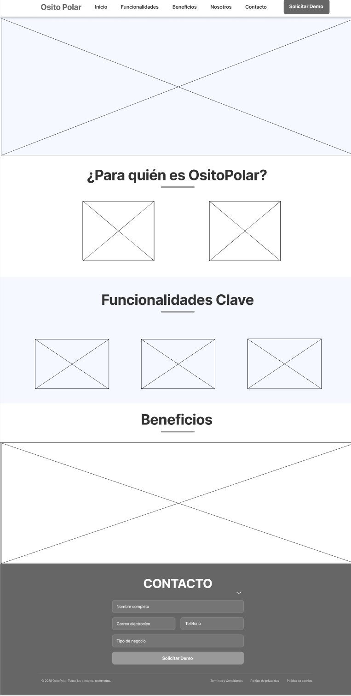
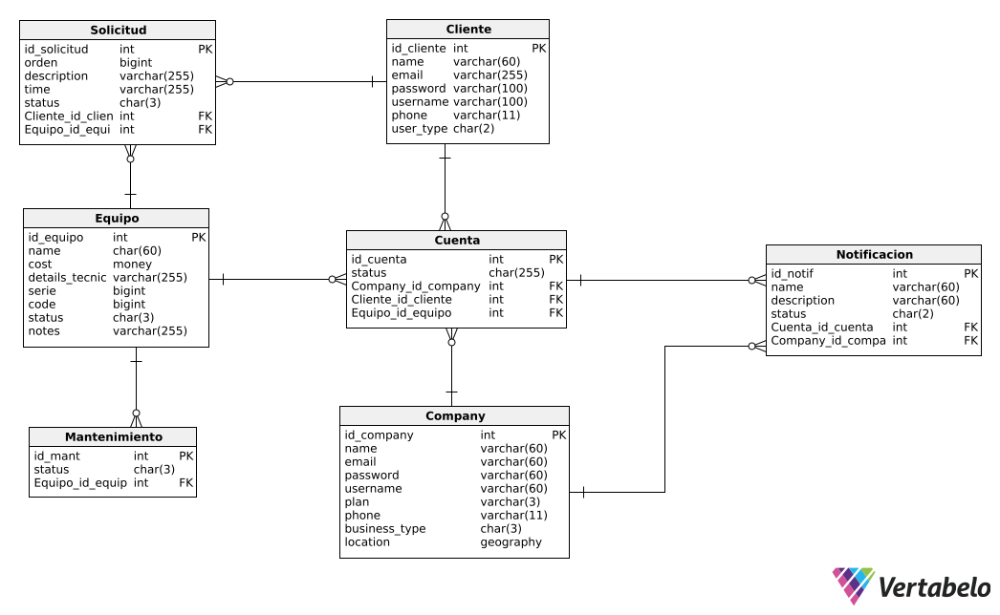

## Capítulo IV: Product Design 

### 4.1. Style Guidelines
#### 4.1.1. General Style Guidelines

Se busca que el tono sea equilibrado, entre lo profesional y lo accesible, con un lenguaje claro, empático y respetuoso para atraer usuarios potenciales y mantener a nuestros usuarios.
Se eligió una paleta de colores fría pero amigable, y una tipografía moderna que combine profesionalismo y accesibilidad.

**Branding**

La identidad visual de OsitoPolar busca transmitir seguridad, innovación y cercanía.

**Logo:** Representa un oso polar con un ícono de refrigeración, combinando lo técnico con lo amigable. Disponible en versiones para fondos claros y oscuros, monocromático, horizontal y vertical.

**Typography**

Para mantener la formalidad y accesibilidad de la interfaz de usuario de OsitoPolar se establecerá las tipografías Helvetica y Open Sans por sus características funcionales, estéticas y por su alta compatibilidad en interfaces digitales, siendo Helvetica la primaria.

**Colors**

La paleta fue diseñada para representar ambientes fríos y tecnológicos, transmitiendo confianza y limpieza visual.

El color principal elegido es el celeste, pues es el que más se acopla a las características que describimos. Se optó por los colores negro, blanco y gris como neutros, los cuales serán utilizados para fondos o textos.
Se eligieron variantes de color verde, rojo, azul y amarillo para ciertos fondos y estados (alertas, servicio, calificaciones).

**Spacing**

Se establecerá un espaciado de 8 px y un margen mínimo de 16 px. Para el diseño modular, se implementarán grids flexibles que se adaptarán tanto a web como a dispositivos móviles, utilizando configuraciones de 12 y 4 columnas respectivamente.

#### 4.1.2. Web Style Guidelines

En esta sección definimos los estándares visuales y de interacción para la versión web de OsitoPolar, asegurando una experiencia de usuario coherente, profesional y accesible en todos los dispositivos.
Es necesario que las interfaces web sean responsivas porque nos trae muchas ventajas tanto para el usuario como para el equipo desarrollador, entre las cuales tenemos: usabilidad en cualquier dispositivo, mejor eficiencia de costos y tiempo en el desarrollo y satisfacción del usuario.

Adoptando un enfoque mobile-first, usamos un sistema de grid de 12 columnas para que la interfaz se adapte a cualquier dispositivo.

**Tipografía**
Tomando en cuenta la guía de estilos, se usará la tipografía Helvetica en la mayoría de los textos de la aplicación, pues esta proyecta profesionalismo y claridad. Para que la visualización de los textos sea óptima, el tamaño de la fuente debe ajustarse automáticamente y adaptarse al dispositivo que se esté usando.

**Colores**
De acuerdo al rubro al que está orientado OsitoPolar, los colores deben reflejar tecnología, frescura y confianza. La elección de colores es la siguiente:

- Celeste (#0884C4): Se usará para el header y algunos botones.
- Blanco (#FFFFFF): Se usará para fondos neutros.
- Negro (#000000): Se usará en algunos botones y bordes.
- Gris claro (#808080): Se usará para líneas, bordes, separadores y botones deshabilitados.
- Blanco azul mar (#F4FCFC): Se usará para algunos fondos.
- Verde medio primavera (#00CC66): Se usará para notificaciones y estados positivos.
- Rojo claro (#FF4B4B): Se usará para alertas, errores y fallas críticas.
- Amarillo mandarina (#FFCC00): Se usará para ciertos agregados (notificaciones, calificaciones).

Sin embargo, la variación de botones y fondos que tendrá la plataforma hace que no siempre se elija la misma tonalidad, por lo que optamos por una paleta de celeste.

De la misma forma se opta por una paleta de rojo claro para diferenciar ventanas, fondos o íconos que muestren algún tipo de error en el sistema, alertas o estados.

### 4.2. Information Architecture

#### 4.2.1. Organization Systems

En esta sección, hemos implementado diferentes sistemas de organización basados en los grupos de información relevantes. La disposición visual del contenido se ha realizado de las siguientes maneras:

- **Jerárquica (visual hierarchy)**: Para resaltar los elementos más importantes, facilitando que los usuarios accedan de manera intuitiva a la información clave.

- **Organización secuencial (step-by-step)**: Utilizada en procesos que requieren una guía detallada, como la compra de maquinas, asegurando un flujo lógico y fácil de seguir.

- **Organización matricial**: Aplicada en áreas donde es necesario comparar o analizar datos relacionados, proporcionando al usuario una visión clara y estructurada de las opciones disponibles.

#### 4.2.2. Labeling Systems

En nuestra empresa, aplicamos estos sistemas de organización visual de la siguiente manera:

Jerarquía Visual: Destacamos información clave como el estado de los equipos y alertas críticas para facilitar su rápida identificación.

Organización Secuencial: El proceso de agendar mantenimiento o visitas técnicas se organiza paso a paso para guiar al usuario.

Organización Matricial: Usamos tablas comparativas para mostrar claramente las diferencias entre planes de suscripción y servicios, facilitando la elección del usuario.

#### 4.2.3. SEO Tags and Meta Tags

**Landing Page**
-Title: OsitoPolar - Monitorea y Gestiona tus Equipos de Congelación en Tiempo Real
-Meta Description: OsitoPolar te permite monitorear y gestionar el estado de tus equipos de congelación, optimizando su rendimiento y evitando fallas. Mantén tu inventario seguro con alertas y mantenimiento predictivo.
-Meta Keywords: monitoreo de congeladoras, gestión de equipos de frío, mantenimiento preventivo, OsitoPolar, alerta de fallas, eficiencia energética
-Meta Author: OsitoPolar

**Aplicación Web**
-Title: OsitoPolar - Plataforma de Gestión de Equipos de Congelación
-Meta Description: OsitoPolar facilita el monitoreo, mantenimiento y eficiencia de tus equipos de congelación. Gestiona en tiempo real el estado y rendimiento de tus equipos con facilidad.
-Meta Keywords: gestión de equipos de frío, monitoreo en tiempo real, mantenimiento predictivo, OsitoPolar, alerta de fallas, reporte de eficiencia
-Meta Author: OsitoPolar

#### 4.2.4. Searching Systems

Estas decisiones están orientadas a facilitar la navegación eficiente, evitando que los usuarios se sientan abrumados por grandes volúmenes de datos y asegurando que encuentren rápidamente lo que necesitan.

**Opciones de Búsqueda**  
**Barra de Búsqueda**  
La barra de búsqueda permite a los usuarios ingresar términos específicos, como el nombre de un equipo, tipo de servicio o estado del equipo, para encontrar rápidamente información relevante. Los resultados se muestran instantáneamente a medida que se escriben los términos.

**Categorías**  
Los usuarios pueden seleccionar entre diferentes categorías de servicios y equipos, como "Congeladoras", "Refrigeradores", "Mantenimiento Preventivo", "Alertas de Fallas" y "Historial de Consumo", para limitar los resultados a un grupo específico.

**Etiquetas Populares**  
Las etiquetas populares, como "Mantenimiento Programado" o "Alertas Críticas", permiten a los usuarios buscar servicios o equipos relacionados con términos comunes, facilitando la localización de opciones populares o especializadas.

**Filtros Disponibles**  
**Filtros por Tipo de Equipo**
- Congeladoras
- Refrigeradores
- Equipos de Frío Industrial

**Filtros por Estado del Equipo**
- En Funcionamiento
- En Reparación
- Necesita Mantenimiento

**Filtro por Fecha de Última Revisión**  
Los usuarios pueden ajustar el filtro para ver los equipos que han sido revisados en un periodo específico, como "Últimos 7 días", "Últimos 30 días", etc.

**Filtro por Consumo Energético**  
Los usuarios pueden ajustar el rango de consumo energético para encontrar equipos dentro de un rango de eficiencia energética deseado.

**Apariencia de los Datos Después de la Búsqueda**  
**Listados de Resultados**  
Los resultados de búsqueda se muestran en una lista ordenada con información clave, como el nombre del equipo, estado actual, próximas fechas de mantenimiento y consumo energético. Además, se incluyen opciones para ver más detalles o agendar visitas de mantenimiento.

**Resumen y Descripción**  
Cada resultado incluye un resumen que resalta la información más relevante, como el historial de mantenimiento o las alertas generadas, permitiendo a los usuarios realizar una evaluación rápida.

**Opciones de Ordenación y Filtros Aplicados**  
Los resultados pueden ordenarse por criterios como relevancia, estado del equipo o consumo energético. Los filtros aplicados se muestran claramente para que los usuarios puedan ajustar su búsqueda según sea necesario.

**Revisiones y Comentarios**  
Los usuarios pueden ver un resumen de las revisiones y comentarios de los técnicos o clientes anteriores sobre el equipo o servicio, lo que les ayuda a evaluar la calidad del servicio y tomar decisiones informadas.

#### 4.2.5. Navigation Systems

La estructura de navegación y las opciones disponibles en **OsitoPolar** están diseñadas para ofrecer una experiencia de usuario fluida y eficiente. A continuación, se resumen las secciones y elementos clave:

1. **Páginas Principales**
    - **Inicio**: Página principal del sitio web.
    - **Funcionalidades**: Detalles sobre las herramientas y servicios que ofrece OsitoPolar.
    - **Beneficios**: Información sobre las ventajas para empresas y proveedores.
    - **Nosotros**: Información sobre la empresa y su misión.
    - **Contacto**: Información de contacto y formulario.

2. **Opciones de Usuario**
    - **Login**: Acceso a cuentas de usuario.
    - **Sign-up**: Registro de nuevos usuarios.
    - **Iniciar sesión / Registrarse**: Alternativa para acceso o creación de cuenta.

3. **Búsqueda y Navegación**
    - **Búsqueda**: Barra de búsqueda para encontrar equipos, servicios o reportes.
    - **Categorías**: Filtros por tipo de equipo (Congeladoras, Refrigeradores, etc.).
    - **Explorar**: Opciones para navegar por diferentes secciones de la plataforma.

4. **Branding y Identidad**
    - **OsitoPolar**: Logo y nombre de la marca, repetidos en varias secciones para mantener la identidad visual de la plataforma.

### 4.3. Landing Page UI Design
#### 4.3.1. Landing Page Wireframe

El wireframe de la página de inicio de OsitoPolar organiza los elementos clave para ofrecer una navegación intuitiva. Incluye un encabezado con el logo y un menú de navegación, seguido de una propuesta de valor clara con botones de acción destacados como "Solicitar Demo" y "¿Cómo Funciona?". La página cuenta con secciones para describir a los usuarios objetivo, las funcionalidades clave del sistema, y los beneficios que ofrece OsitoPolar. Al final, se encuentra un formulario de contacto para que los usuarios soliciten una demo, junto con enlaces legales en el pie de página.

#### 4.3.2. Landing Page Mockup

El Landing Page Mock-up de OsitoPolar muestra un diseño limpio y organizado, con una estructura intuitiva que guía a los usuarios a través de la plataforma. Incluye una propuesta de valor destacada en la parte superior, seguida de secciones clave como las funcionalidades del sistema, los beneficios para empresas y proveedores, y una explicación clara de cómo funciona el servicio. También cuenta con testimonios de clientes, detalles sobre la empresa y un formulario para solicitar una demo, todo con un enfoque en facilitar la conversión de visitantes a usuarios activos.

## 4.4. Web Applications UX/UI Design

#### 4.4.1. Web Applications Wireframes

Los wireframes de las aplicaciones web de OsitoPolar delinean la estructura y organización de las pantallas principales, especificando la ubicación de los elementos de la interfaz de usuario y la navegación. Estos esquemas visuales sirven como una guía precisa para el diseño final, asegurando una experiencia de usuario fluida e intuitiva. Los wireframes están enfocados en la funcionalidad y facilidad de uso, permitiendo que diseñadores y desarrolladores visualicen cómo los usuarios interactúan con la aplicación, optimizando la disposición de los elementos para crear una experiencia eficiente y atractiva.

#### 4.4.2. Web Applications Wireflow Diagrams
En esta sección se presentan los Wireflows para cada objetivo del usuario, teniendo en cuenta los User Personas relevantes. Cada diagrama ilustra el flujo de interacción del usuario y cómo las acciones realizadas afectan las pantallas dentro de la aplicación.

### **Registro y Perfil de Empresa**:
Este flujo de usuario corresponde al proceso de registro de una nueva empresa. En este flujo, el usuario ingresa la información empresarial, como nombre de la empresa y datos de contacto. Al completar el registro, la empresa pasa a estar registrada en la plataforma, con acceso a todas las funcionalidades de gestión de equipos.

### **Gestión de Usuario**:
Este flujo de usuario describe las acciones para que el usuario se registre, inicie sesión, vea su perfil y edite su información personal. El objetivo es mantener actualizados los datos del usuario y facilitar el acceso a sus funcionalidades.

### **Visualización de Equipos**:
En este flujo, el usuario ve un resumen de todos los equipos registrados en su cuenta. Puede ver el estado de los equipos y obtener detalles de cada uno, como su mantenimiento.

### **Gestión de Solicitudes**:
Este flujo permite a las empresas gestionar las solicitudes que realizan los clientes para obtener servicios o equipos adicionales. La empresa puede **aceptar** o **negar** solicitudes.

### **Visualización de Mantenimientos**:
Este flujo permite al usuario ver los mantenimientos pendientes para los equipos. Las empresas pueden agendar o realizar un mantenimiento directamente desde esta vista.

### **Notificaciones**:
Este flujo gestiona las notificaciones que se muestran al usuario, como alertas de mantenimiento, solicitudes aceptadas o rechazadas, y otros eventos importantes.

### **Cambio de Plan de Suscripción**:
Este flujo permite a los usuarios cambiar el plan de suscripción para ajustarse a sus necesidades de equipos o servicios. Los usuarios pueden seleccionar entre diferentes planes según la cantidad de equipos o características que necesiten.

### **Ordenes de trabajo**:
Este flujo permite a las empresas gestionar las órdenes de trabajo generadas por los clientes, de igual manera se puede visualizar si el trabajo ha sido realizado.

### **Mi Equipo y Monitoreo en tiempo real**:
Este flujo permite a los clientes visualizar el estado de su equipo en tiempo real, así como los mantenimientos realizados y las alertas generadas. Los usuarios pueden ver el historial de consumo energético y recibir notificaciones sobre el estado del equipo.

#### 4.4.3. Web Applications Mock-ups
En esta sección se presentan y detallan los mock-ups de las aplicaciones de OsitoPolar. Se resalta la aplicación de los principios de diseño, la arquitectura de la información, el diseño inclusivo y el Design System implementado en los productos digitales. Cada mock-up muestra cómo estos conceptos se integran en la interfaz de usuario. A continuación, se mostrarán las maquetas de la aplicación web, que representan visualmente cómo se verá y funcionará la plataforma OsitoPolar. Estas maquetas son fundamentales para comunicar el diseño a los desarrolladores y clientes, asegurando que la experiencia del usuario se alinee con la visión del proyecto.

Link de los mockups: https://www.figma.com/design/wptd1wiA5c1y2cizdROcMY/Aplicaciones-Web-TP?node-id=2313-3&t=yAzKntbxeGDWIAGd-1

#### 4.4.4. Web Applications User Flow Diagrams
A continuación un diagrama que representa los user goals.

### 4.5. Web Applications Prototyping
A continuación se presenta el prototipo de la aplicación web de OsitoPolar, el cual permite a los usuarios interactuar con la interfaz y explorar las diversas secciones de la plataforma. Este prototipo incluye las funcionalidades clave y características de la aplicación, proporcionando una vista preliminar de la experiencia del usuario. Además, facilita la evaluación y prueba de la interfaz antes de su implementación final, asegurando que el diseño sea intuitivo y eficiente.
Link del prototipo: https://www.figma.com/proto/flGQQP3T3S1hLfh0I72Exj/Aplicaciones-Web?node-id=2380-1261&p=f&t=oDeAQCXay9dwRQG6-1&scaling=min-zoom&content-scaling=fixed&page-id=2313%3A3&starting-point-node-id=2380%3A1233&show-proto-sidebar=1

### 4.6 Domain Driven Software Architecture
En esta sección se presenta la arquitectura de software basada en el dominio para OsitoPolar. Se detallan los diferentes diagramas que ilustran la estructura y organización del sistema, así como los componentes clave que lo integran, mostrando cómo se interconectan para proporcionar una solución eficiente y escalable.

#### 4.6.1. Software Architecture Context Diagram
Este diagrama muestra cómo interactúan los usuarios (Clientes y Empresas Proveedoras) con OsitoPolar. Los usuarios usan la plataforma para gestionar y monitorear equipos de refrigeración. Además, OsitoPolar se conecta con los servicios de correo para enviar notificaciones y con el servicio de pago para procesar transacciones.

#### 4.6.2. Software Architecture Container Diagrams
Este diagrama ilustra los diferentes contenedores dentro de OsitoPolar y cómo interactúan entre sí. Los contenedores representan las diferentes capas y servicios que componen la plataforma, como la interfaz de usuario (webapp), la API y la base de datos.

#### 4.6.3. Software Architecture Components Diagrams

**Mi Equipo Bounded Context**

Este diagrama representa los componentes encargados de la gestión de equipos. Los usuarios pueden agregar equipos, monitorearlos en tiempo real y ver el estado de los mismos.

**Notificaciones Bounded Context**

Este diagrama describe los componentes que gestionan las notificaciones, esenciales para mantener a los usuarios informados sobre el estado de los equipos y otros eventos importantes.

**Ordenes de trabajo Bounded Context**

Este diagrama se centra en la gestión de las órdenes de trabajo. Aquí se muestran los componentes involucrados en el proceso de crear, gestionar y completar órdenes de trabajo.

### 4.7. Software Object-Oriented Design
En esta sección se presenta el diseño de software orientado a objetos para OsitoPolar. Se incluyen diagramas de clases y un diccionario de clases que detallan la estructura y los atributos de las principales entidades del sistema, ofreciendo una visión clara de cómo se organizan y gestionan los componentes clave dentro de la plataforma.

#### 4.7.1. Class Diagrams

El diagrama de clases proporciona una representación visual de las clases del sistema, sus atributos y las relaciones entre ellas.

#### 4.7.2. Class Dictionary

## Clase: Solicitud
| Nº | Nombre de atributo | Descripción                                              | Tipo de dato      |
|----|--------------------|----------------------------------------------------------|-------------------|
| 1  | name_equipo        | Almacena el nombre del equipo solicitado.                | Equipo            |
| 2  | name_usuario       | Almacena el nombre del usuario que realiza la solicitud. | Usuario           |
| 3  | orden              | Almacena el número de orden de la solicitud.             | unsigned long int |
| 4  | description        | Almacena la descripción de la solicitud.                 | varchar           |
| 5  | time               | Almacena el tiempo estimado o requerido.                 | float             |
| 6  | status             | Almacena el estado de la solicitud.                      | char              |

## Clase: Equipo
| Nº | Nombre de atributo | Descripción                             | Tipo de dato      |
|----|--------------------|-----------------------------------------|-------------------|
| 1  | name               | Almacena el nombre del equipo.          | string            |
| 2  | cost               | Almacena el costo del equipo.           | float             |
| 3  | details_tecnicos   | Almacena detalles técnicos del equipo.  | varchar           |
| 4  | serie              | Almacena el número de serie del equipo. | unsigned long int |
| 5  | code               | Almacena el código del equipo.          | unsigned long int |
| 6  | status             | Almacena el estado del equipo.          | char              |
| 7  | notes              | Almacena notas adicionales del equipo.  | varchar           |

## Clase: Cliente
| Nº | Nombre de atributo | Descripción                                | Tipo de dato |
|----|--------------------|--------------------------------------------|--------------|
| 1  | name               | Almacena el nombre del cliente.            | string       |
| 2  | email              | Almacena el correo del cliente.            | string       |
| 3  | password           | Almacena la contraseña del cliente.        | string       |
| 4  | username           | Almacena el nombre de usuario del cliente. | string       |
| 5  | phone              | Almacena el teléfono del cliente.          | string       |
| 6  | user_type          | Almacena el tipo de usuario.               | char         |

## Clase: Company
| Nº | Nombre de atributo | Descripción                                     | Tipo de dato |
|----|--------------------|-------------------------------------------------|--------------|
| 1  | name               | Almacena el nombre de la empresa.               | string       |
| 2  | email              | Almacena el correo electrónico de la empresa.   | string       |
| 3  | password           | Almacena la contraseña de la empresa.           | string       |
| 4  | username           | Almacena el nombre de usuario de la empresa.    | string       |
| 5  | plan               | Almacena el tipo de plan que posee la empresa.  | char         |
| 6  | phone              | Almacena el teléfono de contacto de la empresa. | string       |
| 7  | business_type      | Almacena el tipo de negocio de la empresa.      | char         |
| 8  | location           | Almacena la ubicación física de la empresa.     | string       |

##  Clase: Cuenta
| Nº | Nombre de atributo | Descripción                                         | Tipo de dato |
|----|--------------------|-----------------------------------------------------|--------------|
| 1  | name (company)     | Almacena el nombre de la empresa asociada.          | Company      |
| 2  | name (usuario)     | Almacena el nombre del usuario asociado.            | Usuario      |
| 3  | cost               | Almacena el costo del equipo vinculado a la cuenta. | Equipo       |
| 4  | status             | Almacena el estado de la cuenta.                    | char         |

##  Clase: Mantenimiento
| Nº | Nombre de atributo | Descripción                                     | Tipo de dato |
|----|--------------------|-------------------------------------------------|--------------|
| 1  | name               | Almacena el nombre del equipo en mantenimiento. | Equipo       |
| 2  | status             | Almacena el estado del mantenimiento.           | char         |

##  Clase: Notificación
| Nº | Nombre de atributo | Descripción                                                  | Tipo de dato |
|----|--------------------|--------------------------------------------------------------|--------------|
| 1  | name               | Almacena el nombre de la notificación.                       | varchar      |
| 2  | description        | Almacena la descripción de la notificación.                  | varchar      |
| 3  | name_company       | Almacena el nombre de la empresa asociada a la notificación. | Company      |
| 4  | name_cliente       | Almacena el nombre del cliente destinatario.                 | Cliente      |
| 5  | status             | Indica si la notificación ha sido leída o procesada.         | bool         |

### 4.8. Database Design

Esta sección presenta la estructura lógica del sistema desde el punto de vista de almacenamiento y organización de los datos. Se describen las entidades principales del sistema, sus atributos, tipos de datos y relaciones entre ellas. El modelo de base de datos ha sido diseñado para garantizar integridad, consistencia y eficiencia en el acceso a la información.

#### 4.8.1. Database Diagram

El diagrama de base de datos ilustra gráficamente cómo se relacionan las tablas dentro del sistema, incluyendo sus claves primarias, claves foráneas y los tipos de relaciones existentes (uno a uno, uno a muchos o muchos a muchos).

