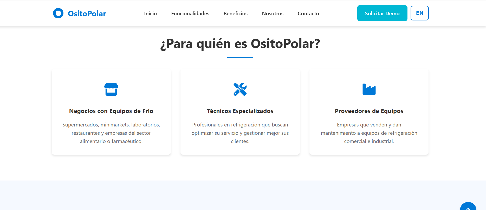
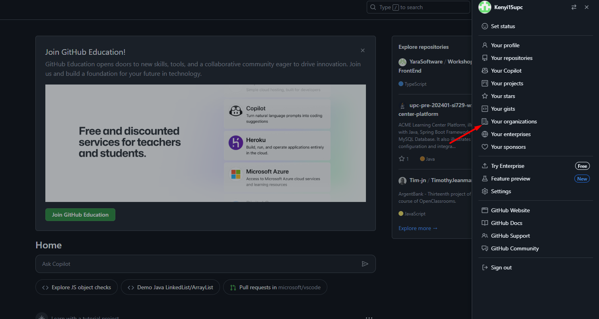
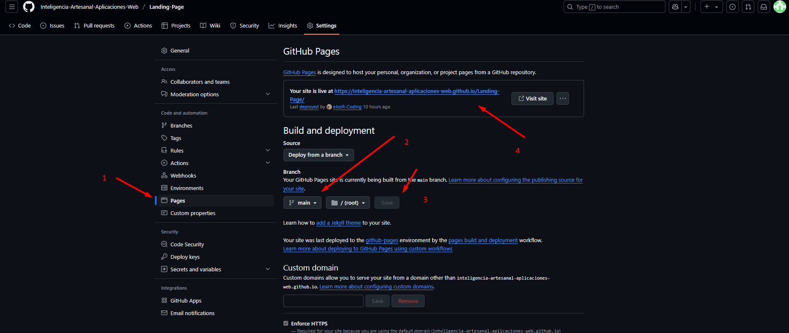
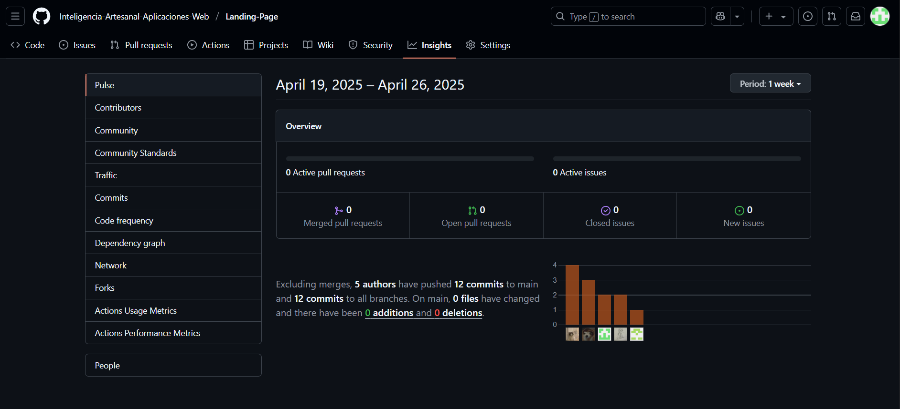
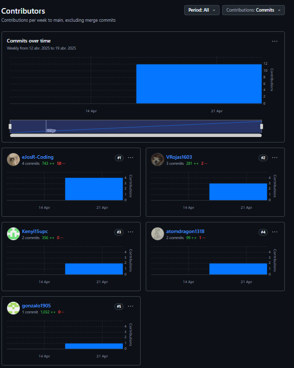

## Capítulo V: Product Implementation, Validation & Deployment 

### 5.1. Software Configuration Management
#### 5.1.1. Software Development Environment Configuration

### Project Management

Para la administración del proyecto se recurrió al uso de herramientas de comunicación y control de versiones. Se creó una organización en GitHub para centralizar la gestión del código fuente y su versionado. En cuanto a la comunicación interna y las reuniones del equipo, se utilizó Discord.

**Organización del trabajo:** Github

**Reuniones:** Discord

**Comunicación:** Whatsapp

**Planificación y asignación de tareas:** Trello

**Enlaces**

- Github: https://github.com/
- Discord: https://discord.com/
- Trello: https://trello.com/

### Requirement Management

Para esta fase, se implementaron soluciones personalizadas que facilitaron la recolección, organización y priorización de los requisitos del proyecto.
Se utilizó Trello como una herramienta visual para gestionar tareas mediante tableros personalizados.
Se utilizó UXPressia para poder desarrollar los user personas, empathy maps, journey maps y lean UX canvas.
Se utilizó Miro para el desarrollo de los As-Is y To-Be Scenarios.

**Enlaces**

- Trello: https://trello.com/
- UXPressia: https://uxpressia.com/
- Miro: https://miro.com/es/

### Product UX/UI Design
En el diseño de la experiencia e interfaz de usuario, el equipo utilizó Figma para la creación de wireframes, mockups y prototipos interactivos, lo que permitió validar la propuesta de diseño antes de la implementación.

**Enlaces**
- Figma: https://www.figma.com/

### Software Development
Para el desarrollo de la Landing Page se usaron los lenguajes HTML, CSS y JavaScript en Visual Studio Code. La elaboración del informe se realizó en archivos .md en IDEs como IntelliJ IDEA y Rider (cada miembro del equipo trabajó en alguna de estas herramientas).
Para descargar, instalar y actualizar fácilmente estas IDEs utilizamos la aplicación de gestión JetBrains ToolBox.

**Enlaces**
- JetBrains ToolBox: https://www.jetbrains.com/toolbox-app/
- Visual Studio Code: https://code.visualstudio.com/

### Software Documentation
Para el control de versiones y la colaboración en el desarrollo del informe, se utilizó GitHub siguiendo la estrategia de trabajo GitHub Flow. Esta metodología permitió una gestión eficiente y ordenada del proyecto mediante el uso de ramas específicas para cada funcionalidad o corrección, lo que facilitó el trabajo colaborativo. Todo el contenido del proyecto fue centralizado y almacenado en un repositorio dentro de una organización creada en GitHub.
Para la documentación técnica del proyecto se optó por el uso de archivos en formato Markdown, debido a su simplicidad, legibilidad y excelente compatibilidad con GitHub.

**Enlaces**
- GitHub: https://github.com/

### Software Deployment
Para el despliegue de la Landing Page se utilizó GitHub Pages, una herramienta perfecta para publicar sitios web estáticos.

**Enlaces**
- GithubPages: https://pages.github.com/

#### 5.1.2. Source Code Management

Modelo de ramas Git Flow: main: rama principal donde siempre está el código estable y listo para producción. develop: rama de desarrollo donde se integran todas las nuevas funcionalidades antes de pasar a producción. feature/: ramas para trabajar nuevas funcionalidades. release/: ramas temporales para preparar una nueva versión estable. hotfix/: ramas para corregir errores en producción.

Versionado semántico (Semantic Versioning): Se aplicará el versionado semántico (Semantic Versioning 2.0.0), siguiendo el esquema: MAJOR.MINOR.PATCH.
1.0.0 → versión estable inicial

1.1.0 → agregaste nuevas funcionalidades

1.1.1 → arreglos de bugs

Convención de mensajes de commits El equipo seguirá la convención de mensajes de commits definida en “Conventional Commits”.
Ejemplos de mensajes:

- feat: agregar nuevo sistema de login
- fix: corregir validación en formulario de registro
- docs: actualizar README con instrucciones de despliegue

Nomenclatura de numeración de las versiones: Major changes: Cuando el código o versión nueva del proyecto a implementar presenta cambios significativos con la versión anterior, estos cambios llegan a ser incompatibles con la versión anterior. Minor changes: Cuando el código o versión nueva del proyecto a implementar presenta cambios con respecto a alguna característica Patch: Cuando se solucionan bugs menores.

**Repositorio de Github:**
- Enlace para acceder a la [organización en Github](https://github.com/Inteligencia-Artesanal-Aplicaciones-Web)
- Enlace para acceder al repositorio de la [Landing Page](https://github.com/Inteligencia-Artesanal-Aplicaciones-Web/Landing-Page)
- Enlace para acceder al repositorio del [Informe](https://github.com/Inteligencia-Artesanal-Aplicaciones-Web/upc-AppWeb-Inteligencia-Artesanal-Report)

**Flujo de trabajo de GitFlow**
El flujo de trabajo se basará en un modelo de ramas Git Flow, el cuál se basa en la creación de ramas específicas para cada funcionalidad o corrección de errores. El modelo de "A succesful Git branching model"

--Insertar imagen

**Estructura de branches (Ramas):**

1. **Master branch (Rama principal):** Es la rama principal del proyecto, donde se almacena el código estable y listo para producción. Solo se integrarán cambios que hayan sido probados y validados previamente en las ramas de desarrollo y funcionalidad.

2. **Develop Branch (Rama de Desarrollo):** Esta rama actúa como un espacio de integración para el trabajo en equipo, permitiendo pruebas y ajustes de las nuevas funcionalidades antes de fusionarlas con la rama principal. Garantiza que el código sea funcional y estable.

3. **Feature branch (Ramas de funcionalidad):** Cada nueva funcionalidad o tarea específica se desarrollará en su propia rama. Una vez completada y probada, se integrará en la rama de desarrollo. Las ramas de funcionalidad seguirán un esquema de nombres descriptivos, como por ejemplo: `feature/chapter-01`.

#### 5.1.3. Source Code Style Guide & Conventions

El equipo adoptará nomenclatura en inglés para todas las variables, funciones, clases y archivos del proyecto, con el objetivo de mantener flexibilidad, escalabilidad y coherencia en el desarrollo. HTML / CSS Se sigue el Google HTML/CSS Style Guide.

Las clases CSS estarán en kebab-case (.main-header, .card-title).

Se utilizarán etiquetas semánticas

- &lt;header&gt;
- &lt;section&gt;
- &lt;article&gt;

Identificadores claros y descriptivos para accesibilidad y mantenimiento.

Se usó diferentes etiquetas para conformar la estructura del Landing Page del producto:

- header: Define todo el contenido introductorio de la página web.

- nav: Define las secciones de la página que estarán dedicadas a la navegación en la página.

- div: Esta etiqueta permite la separación de diferentes objetos dentro de nuestra página, esto nos permitió poder aplicar hojas de estilo específicas para cada parte de los objetos.

- img: Esta etiqueta permite la inserción de imágenes en la página web, se usó en diversas ocasiones dentro de la página.

- ul: Esta etiqueta sirve para definir una lista desordenada, mayormente se usó para la elaboración del menú interactivo de la página.

- li: Sirve para definir los elementos de las listas que se implementaron en la página, más especifico en la barra de búsqueda y el blog.

- a: Se usó para definir hipervínculos para mover a los usuarios a través de las diferentes secciones de la página.

- p: Definen los párrafos de texto, separándolos del resto de contenido.

- button: Declaran un botón interactivo modificable que permite a los usuarios realizar una acción en específico.

- h1 - h4: Definen los diferentes títulos y subtítulos de la página siendo h1 el mayor nivel y h4 el más bajo.

#### 5.1.4. Software Deployment Configuration

### Landing page deployment:
Para desplegar la landing page, es necesario cumplir con ciertos requisitos previos, como contar con una cuenta personal, una organización y un repositorio donde se alojarán los archivos. Una vez cumplidos estos requisitos, se pueden seguir los pasos detallados a continuación para realizar el despliegue:

1. Verificar que los archivos principales se encuentren en la raíz (root) del repositorio.
2. Asegurarse de que los archivos sigan las siguientes convenciones de nombres: "index.html" para la página principal, "styles.css" para los estilos, "script.js" para los scripts principales, "languages.js" para gestionar los textos en diferentes idiomas (español e inglés), y una carpeta llamada "assets/images" para las imágenes.
3. Subir los archivos al repositorio mediante un commit.
4. Acceder a la sección Settings > Pages y seleccionar el branch correspondiente, en este caso, "main".
5. Configurar la carpeta raíz (root) como la fuente de la página.
6. Esperar a que GitHub realice las verificaciones necesarias. Una vez finalizado el proceso, se generará un enlace que permitirá acceder a la landing page desplegada.

Adicionalmente, se implementó un archivo "languages.js" que contiene los textos en español e inglés. Este archivo es consumido por el script "main.js", el cual permite realizar el cambio de idioma dinámicamente en la landing page.ations Implementation

### Github Pages:

La URL que nos entrega Github Pages para acceder a la landing page es la siguiente: https://inteligencia-artesanal-aplicaciones-web.github.io/Landing-Page/

### 5.2. Landing Page, Services & Applications Implementation.

En el siguiente enlace se estará mostrando la landing page de la startup:
[Video demostrativo de la landing page](https://upcedupe-my.sharepoint.com/:v:/g/personal/u202223286_upc_edu_pe/EWpS23aHI95KiF5rJXhOyHgBoHAL62jYwnz8m4zMqxkGwA?nav=eyJyZWZlcnJhbEluZm8iOnsicmVmZXJyYWxBcHAiOiJPbmVEcml2ZUZvckJ1c2luZXNzIiwicmVmZXJyYWxBcHBQbGF0Zm9ybSI6IldlYiIsInJlZmVycmFsTW9kZSI6InZpZXciLCJyZWZlcnJhbFZpZXciOiJNeUZpbGVzTGlua0NvcHkifX0&e=bwYjby)

En la sección siguiente se detallará el proceso de implementación, documentación y despliegue del Landing.

#### 5.2.1. Sprint 1
##### 5.2.1.1. Sprint Planning 1
<table>
<tr>
    <th colspan="5">Sprint 1</th>
    <th colspan="9">Sprint 1</th>
  </tr>
      <tr>
    <td colspan="13">Sprint Planning Background</td>
  </tr>
  <tr>
    <td colspan="5">Date</td>
    <td colspan="8">2025-04-22</td>
</tr>
  <tr>
    <td colspan="5">Time</td>
    <td colspan="8">9:45 PM</td>
  </tr>
  <tr>
    <td colspan="5">Location</td>
    <td colspan="8">Via Discord</td>
<tr>
    <td colspan="5">Prepared By</td>
    <td colspan="8">Kenyi Ramirez</td>
</tr>
<tr>
    <td colspan="5">Attendees (to planning meeting)</td>
    <td colspan="8">Joseph Rodriguez, Wilder Aliaga, Victor Rojas, Italo Verona</td>
</tr>
<tr>
    <td colspan="5">Sprint  1 Review Summary</td>
    <td colspan="8">Esta sección se dedicó a mejorar el codigo de la Landing page para poder usarse mejor y tener una estructura clara.</td>
</tr>
<tr>
    <td colspan="5">Sprint 1 Retrospective Summary</td>
    <td colspan="8">En esta sección tuvimos varios aciertos ya que hubieron ideas para integrar lo de los idiomas bastante convicentes pero nos quedamos con una en especifica, poniendo a prueba nuestra resolución de problemas.</td>
</tr>
<tr>
    <td colspan="13">Sprint Goal & User Stories</td>
</tr>
<tr>
    <td colspan="5">Sprint 1 Goal</td>
       <td colspan="8">Nuestro enfoque está en implementar la landing page de OsitoPolar, asegurando su adaptabilidad a diferentes dispositivos, coherencia visual y funcionalidad multilingüe. Creemos que esto ofrece una experiencia de navegación más clara, atractiva y accesible a los usuarios potenciales de nuestra solución. Esto se confirmará cuando los usuarios puedan cambiar el idioma fácilmente desde la interfaz, navegar la página sin errores visuales desde cualquier dispositivo, y se valide que imágenes y textos estén correctamente integrados y espaciados. </td>

</tr>
<tr>
    <td colspan="5">Sprint 1 Velocity</td>
    <td colspan="8">15</td>
<tr>
    <td colspan="5">Sum of Story Points</td>
    <td colspan="8">14</td>
</tr>
</table>

##### 5.2.1.2. Aspect Leaders and Collaborators

Durante este primer Sprint, el equipo se enfocó principalmente en el desarrollo, la mejora estructural y visual de la Landing Page de OsitoPolar, asegurando su visualización en distintos dispositivos (diseño responsive), la integración armoniosa de imágenes y textos, y la implementación de un cambio de idioma dinámico mediante un botón.
Con el fin de organizar de manera más eficiente el trabajo colaborativo, se ha elaborado la matriz de Liderazgo y Colaboración (LACX). Esta matriz asigna responsabilidades específicas a cada miembro del equipo en relación con los aspectos clave del Sprint.
<table>
  <tr>
    <td colspan="2"><strong>Team Member (Last Name, First Name)</strong></td>
    <td><strong>GitHub Username</strong></td>
    <td><strong>Diseño visual y maquetación web (Landing Page) Leader (L) / Collaborator (C)</strong></td>
    <td><strong>Implementación técnica del cambio de idioma (Multilenguaje funcional) Leader (L) / Collaborator (C)</strong></td>
    <td><strong>Responsividad y pruebas en distintos dispositivos Leader (L) / Collaborator (C)</strong></td>
  </tr>
  <tr>
    <td colspan="2">Ramírez Cabrera, Kenyi Efrain</td>
    <td>Kenyi15upc</td>
    <td>L</td>
    <td>C</td>
    <td>C</td>
  </tr>
  <tr>
    <td colspan="2">Rodriguez Parco Joseph Pablo </td>
    <td>eJosR-Coding</td>
    <td>C</td>
    <td>L</td>
    <td>L</td>
  </tr>
  <tr>
    <td colspan="2"> Aliaga Urbina Wilder Gonzalo </td>
    <td>Gonzalo1905</td>
    <td>C</td>
    <td>C</td>
    <td>C</td>
  </tr>
  <tr>
    <td colspan="2">Verona Flores Italo Sebastián
</td>
    <td>atomdragon1318</td>
    <td>C</td>
    <td>C</td>
    <td>C</td>
  </tr>
  <tr>
    <td colspan="2">Rojas Reategui Victor Manuel </td>
    <td>VRojas1603</td>
    <td>C</td>
    <td>C</td>
    <td>C</td>
  </tr>
</table>

##### 5.2.1.3. Sprint Backlog 1

El objetivo principal de este Sprint es elaborar la Landing Page de nuestra plataforma OsitoPolar. Para ello, dividimos el desarrollo de esta según las User Stories pertenecientes a la Epic enfocada en Landing Page. La plataforma elegida para ser la herramienta de control de tareas fue Trello, el cuál se presenta una captura de pantalla de nuestro tablero y su enlace público.

Enlace: https://trello.com/b/xAOjqyPz/inteligenciaartesanal-ositopolar

<table>
<tr>
    <th colspan="3">Sprint #</th>
    <th colspan="10">Sprint 1</th>
</tr>
<tr>
    <td colspan="3">User Story</td>
    <td colspan="10">Work-Item/Task</td>
</tr>
<tr>
    <td colspan="1">Id</td>
    <td colspan="2">Title</td>
    <td colspan="1">Id</td>
    <td colspan="2">Title</td>
    <td colspan="3">Description</td>
    <td colspan="1">Estimation (Hours)</td>
    <td colspan="2">Assigned To</td>
    <td colspan="1">Status (To do/ In-Process/ To-Review/ Done)</td>
</tr>
<tr>
    <td colspan="1">US-23</td>
    <td colspan="2">Visualizar propuesta de valor principal</td>
    <td colspan="1">UT-01</td>
    <td colspan="2">Crear la sección 'Hero'</td>
    <td colspan="3">Añadir la sección donde se muestra nuestra propuesta de valor principal y las entidades que confían en nosotros</td>
    <td colspan="1">0.5</td>
    <td colspan="2">Victor Rojas</td>
    <td colspan="1">Done</td>
</tr>
<tr>
    <td colspan="1">US-23</td>
    <td colspan="2">Visualizar propuesta de valor principal</td>
    <td colspan="1">UT-02</td>
    <td colspan="2">Añadir estilos CSS</td>
    <td colspan="3">Aplicar estilos según el diseño aprobado</td>
    <td colspan="1">0.5</td>
    <td colspan="2">Wilder Gonzalo Aliaga</td>
    <td colspan="1">Done</td>
</tr>
<tr>
    <td colspan="1">US-23</td>
    <td colspan="2">Visualizar propuesta de valor principal</td>
    <td colspan="1">UT-03</td>
    <td colspan="2">Añadir interacciones con JS</td>
    <td colspan="3">Agregar efectos y validaciones según el diseño</td>
    <td colspan="1">0.5</td>
    <td colspan="2">Victor Rojas</td>
    <td colspan="1">Done</td>
</tr>
<tr>
    <td colspan="1">US-24</td>
    <td colspan="2">Explorar soluciones específicas para mi rubro</td>
    <td colspan="1">UT-04</td>
    <td colspan="2">Crear la sección 'Beneficios'</td>
    <td colspan="3">Añadir la sección donde se visualizan las soluciones específicas a cada segmento (beneficios) </td>
    <td colspan="1">0.5</td>
    <td colspan="2">Kenyi Ramírez</td>
    <td colspan="1">Done</td>
</tr>
<tr>
    <td colspan="1">US-24</td>
    <td colspan="2">Explorar soluciones específicas para mi rubro</td>
    <td colspan="1">UT-05</td>
    <td colspan="2">Añadir estilos CSS</td>
    <td colspan="3">Aplicar estilos según el diseño aprobado de 'Beneficios'</td>
    <td colspan="1">0.5</td>
    <td colspan="2">Wilder Gonzalo Aliaga</td>
    <td colspan="1">Done</td>
</tr>
<tr>
    <td colspan="1">US-24</td>
    <td colspan="2">Explorar soluciones específicas para mi rubro</td>
    <td colspan="1">UT-06</td>
    <td colspan="2">Añadir interacciones con JS</td>
    <td colspan="3">Agregar efectos y validaciones según el diseño de 'Beneficios'</td>
    <td colspan="1">0.5</td>
    <td colspan="2">Victor Rojas</td>
    <td colspan="1">Done</td>
</tr>
<tr>
    <td colspan="1">US-25</td>
    <td colspan="2">Comprender funcionalidades destacadas</td>
    <td colspan="1">UT-07</td>
    <td colspan="2">Crear la sección 'Funcionalidades'</td>
    <td colspan="3">Añadir la sección donde se visualizan las funciones principales de la plataforma</td>
    <td colspan="1">1</td>
    <td colspan="2">Italo Verona</td>
    <td colspan="1">Done</td>
</tr>
<tr>
    <td colspan="1">US-25</td>
    <td colspan="2">Comprender funcionalidades destacadas</td>
    <td colspan="1">UT-08</td>
    <td colspan="2">Añadir estilos CSS</td>
    <td colspan="3">Aplicar estilos según el diseño aprobado de 'Funcionalidades'</td>
    <td colspan="1">0.5</td>
    <td colspan="2">Wilder Gonzalo Aliaga</td>
    <td colspan="1">Done</td>
</tr>
<tr>
    <td colspan="1">US-25</td>
    <td colspan="2">Comprender funcionalidades destacadas</td>
    <td colspan="1">UT-09</td>
    <td colspan="2">Añadir interacciones con JS</td>
    <td colspan="3">Agregar efectos y validaciones según el diseño de 'Funcionalidades'</td>
    <td colspan="1">0.5</td>
    <td colspan="2">Victor Rojas</td>
    <td colspan="1">Done</td>
</tr>
<tr>
    <td colspan="1">US-26</td>
    <td colspan="2">Solicitar una demo fácilmente</td>
    <td colspan="1">UT-10</td>
    <td colspan="2">Crear la sección 'Solicitar Demo'</td>
    <td colspan="3">Añadir la sección donde se puede solicitar una demo de nuestra plataforma</td>
    <td colspan="1">1</td>
    <td colspan="2">Kenyi Ramírez</td>
    <td colspan="1">Done</td>
</tr>
<tr>
    <td colspan="1">US-26</td>
    <td colspan="2">Solicitar una demo fácilmente</td>
    <td colspan="1">UT-11</td>
    <td colspan="2">Añadir estilos CSS</td>
    <td colspan="3">Aplicar estilos según el diseño aprobado de 'Solicitar demo'</td>
    <td colspan="1">0.5</td>
    <td colspan="2">Wilder Gonzalo Aliaga</td>
    <td colspan="1">Done</td>
</tr>
<tr>
    <td colspan="1">US-26</td>
    <td colspan="2">Solicitar una demo fácilmente</td>
    <td colspan="1">UT-12</td>
    <td colspan="2">Añadir interacciones con JS</td>
    <td colspan="3">Agregar efectos y validaciones según el diseño de 'Solicitar demo'</td>
    <td colspan="1">0.5</td>
    <td colspan="2">Victor Rojas</td>
    <td colspan="1">Done</td>
</tr>
<tr>
    <td colspan="1">US-27</td>
    <td colspan="2">Conocer misión y visión de la startup</td>
    <td colspan="1">UT-13</td>
    <td colspan="2">Crear la sección 'Nosotros'</td>
    <td colspan="3">Añadir la sección donde se visualiza la misión y visión de nuestra startup</td>
    <td colspan="1">0.5</td>
    <td colspan="2">Italo Verona</td>
    <td colspan="1">Done</td>
</tr>
<tr>
    <td colspan="1">US-27</td>
    <td colspan="2">Conocer misión y visión de la startup</td>
    <td colspan="1">UT-14</td>
    <td colspan="2">Añadir estilos CSS</td>
    <td colspan="3">Aplicar estilos según el diseño aprobado de 'Nosotros'</td>
    <td colspan="1">0.5</td>
    <td colspan="2">Wilder Gonzalo Aliaga</td>
    <td colspan="1">Done</td>
</tr>
<tr>
    <td colspan="1">US-27</td>
    <td colspan="2">Conocer misión y visión de la startup</td>
    <td colspan="1">UT-15</td>
    <td colspan="2">Añadir interacciones con JS</td>
    <td colspan="3">Agregar efectos y validaciones según el diseño de 'Nosotros'</td>
    <td colspan="1">0.5</td>
    <td colspan="2">Victor Rojas</td>
    <td colspan="1">Done</td>
</tr>
<tr>
    <td colspan="1">US-00</td>
    <td colspan="2">-</td>
    <td colspan="1">NT-16</td>
    <td colspan="2">Implementar cambio de idioma</td>
    <td colspan="3">Implementar la funcionalidad de cambio de idioma en la landing page</td>
    <td colspan="1">2</td>
    <td colspan="2">Joseph Rodríguez</td>
    <td colspan="1">Done</td>
</tr>
<tr>
    <td colspan="1">US-00</td>
    <td colspan="2">-</td>
    <td colspan="1">NT-17</td>
    <td colspan="2">Añadir imágenes complementarias</td>
    <td colspan="3">Agregar imágenes complementarias en las diferentes secciones del landing page</td>
    <td colspan="1">0.5</td>
    <td colspan="2">Joseph Rodríguez</td>
    <td colspan="1">Done</td>
</tr>

</table>

##### 5.2.1.4. Development Evidence for Sprint Review

En este primer Sprint hemos realizado la implementación de nuestra Landing Page, donde todo el equipo ha aportado en varias tareas. En la siguiente tabla se muestran los commits realizados.

<table>
    <tr>
        <th colspan="2">Repository</th>
        <th colspan="2">Branch</th>
        <th colspan="2">Commit Id</th>
        <th colspan="2">Commit Message</th>
        <th colspan="2">Commit Message Body</th>
        <th colspan="2">Commited on (Date)</th>
    </tr>
        <tr>
        <td colspan="2">Inteligencia-Artesanal-Aplicaciones-Web/Landing-Page</td>
        <td colspan="2">main</td>
        <td colspan="2">9caef73</td>
        <td colspan="2">chore: added html file</td>
        <td colspan="2">added html file</td>
        <td colspan="2">25/04/2025</td>
    </tr>
        <tr>
        <td colspan="2">Inteligencia-Artesanal-Aplicaciones-Web/Landing-Page</td>
        <td colspan="2">main</td>
        <td colspan="2">ae1fd12</td>
        <td colspan="2">feat: added header and footer section</td>
        <td colspan="2">added header and footer section</td>
        <td colspan="2">25/04/2025</td>
    </tr>
     <tr>
        <td colspan="2">Inteligencia-Artesanal-Aplicaciones-Web/Landing-Page</td>
        <td colspan="2">main</td>
        <td colspan="2">10093f4</td>
        <td colspan="2">style: Add styles</td>
        <td colspan="2">Add styles</td>
        <td colspan="2">25/04/2025</td>
    </tr>
    <tr>
        <td colspan="2">Inteligencia-Artesanal-Aplicaciones-Web/Landing-Page</td>
        <td colspan="2">main</td>
        <td colspan="2">5a4332d</td>
        <td colspan="2">feat: added script.js</td>
        <td colspan="2">added script.js</td>
        <td colspan="2">25/04/2025</td>
    </tr>
    <tr>
        <td colspan="2">Inteligencia-Artesanal-Aplicaciones-Web/Landing-Page</td>
        <td colspan="2">main</td>
        <td colspan="2">72f4157</td>
        <td colspan="2">feat: added hero section.</td>
        <td colspan="2">added hero section.</td>
        <td colspan="2">25/04/2025</td>
    </tr>
   <tr>
        <td colspan="2">Inteligencia-Artesanal-Aplicaciones-Web/Landing-Page</td>
        <td colspan="2">main</td>
        <td colspan="2">e875205</td>
        <td colspan="2">fix: fixed header section.</td>
        <td colspan="2">fixed header section.</td>
        <td colspan="2">25/04/2025</td>
    </tr>
   <tr>
        <td colspan="2">Inteligencia-Artesanal-Aplicaciones-Web/Landing-Page</td>
        <td colspan="2">main</td>
        <td colspan="2">9624ec5</td>
        <td colspan="2">feat: update hero section images and testimonials</td>
        <td colspan="2">update hero section images and testimonials</td>
        <td colspan="2">25/04/2025</td>
    </tr>
   <tr>
        <td colspan="2">Inteligencia-Artesanal-Aplicaciones-Web/Landing-Page</td>
        <td colspan="2">main</td>
        <td colspan="2">9bc4018</td>
        <td colspan="2">feat: Funcionalidades Section</td>
        <td colspan="2">Funcionalidades Section</td>
        <td colspan="2">25/04/2025</td>
    </tr>
   <tr>
        <td colspan="2">Inteligencia-Artesanal-Aplicaciones-Web/Landing-Page</td>
        <td colspan="2">main</td>
        <td colspan="2">9e6c718</td>
        <td colspan="2">feat: add language toggle button and translation functionality (WIP)</td>
        <td colspan="2">add language toggle button and translation functionality (WIP)</td>
        <td colspan="2">25/04/2025</td>
    </tr>
   <tr>
        <td colspan="2">Inteligencia-Artesanal-Aplicaciones-Web/Landing-Page</td>
        <td colspan="2">main</td>
        <td colspan="2">a99916d</td>
        <td colspan="2">feat: nosotros section</td>
        <td colspan="2">nosotros section</td>
        <td colspan="2">25/04/2025</td>
    </tr>
   <tr>
        <td colspan="2">Inteligencia-Artesanal-Aplicaciones-Web/Landing-Page</td>
        <td colspan="2">main</td>
        <td colspan="2">022b681</td>
        <td colspan="2">feat: add multilingual support for functionalities and company sections</td>
        <td colspan="2">add multilingual support for functionalities and company sections</td>
        <td colspan="2">25/04/2025</td>
    </tr>
   <tr>
        <td colspan="2">Inteligencia-Artesanal-Aplicaciones-Web/Landing-Page</td>
        <td colspan="2">main</td>
        <td colspan="2">3ddec9f</td>
        <td colspan="2">feat: update about section image to enhance visual content</td>
        <td colspan="2">update about section image to enhance visual content</td>
        <td colspan="2">26/04/2025</td>
    </tr>

</table>

##### 5.2.1.5. Execution Evidence for Sprint Review

Como equipo, lo que logramos en este primer Sprint fue la exitosa implementación de nuestra Landing Page y su posterior despliegue gracias a la herramienta GitHub Pages. A continuación, presentaremos lo logrado a través de imágenes mostrando las principales vistas.

- Esta es la sección inicial, donde está el header y nuestra propuesta de valor.
  

- Aquí se puede observar la sección donde se presenta a los usuarios a los que está orientado nuestra plataforma.
  

- Esta sección describe las funcionalidades claves principales de nuestra plataforma OsitoPolar.
  

- Tenemos en esta sección la visualización de los beneficios que obtendrá cada uno de nuestros usuarios de cada segmento.
  
  

- También se encuentra la sección de nuestra misión y visión.
  

- Por último, está la sección donde podemos solicitar una demo.
  

- Para más detalles, visualizar el video: [Video demostrativo de la landing page](https://upcedupe-my.sharepoint.com/:v:/g/personal/u202223286_upc_edu_pe/EWpS23aHI95KiF5rJXhOyHgBoHAL62jYwnz8m4zMqxkGwA?nav=eyJyZWZlcnJhbEluZm8iOnsicmVmZXJyYWxBcHAiOiJPbmVEcml2ZUZvckJ1c2luZXNzIiwicmVmZXJyYWxBcHBQbGF0Zm9ybSI6IldlYiIsInJlZmVycmFsTW9kZSI6InZpZXciLCJyZWZlcnJhbFZpZXciOiJNeUZpbGVzTGlua0NvcHkifX0&e=bwYjby)

##### 5.2.1.6. Services Documentation Evidence for Sprint Review

Durante este Sprint solo se realizó la Landing Page, no se han documentado nuevos Endpoints relacionados con el alcance definido, por lo tanto, no se dispone de documentación generada en OpenAPI para esta entrega.

##### 5.2.1.7. Software Deployment Evidence for Sprint Review

Durante el presente Sprint, se llevó a cabo el despliegue de la Landing Page del proyecto utilizando GitHub Pages como proveedor de hosting. Esta actividad forma parte del proceso de Deployment, siendo un primer paso en la publicación de productos desarrollados en este Sprint.

**Pasos realizados**

1. Iniciamos sesión en GitHub. En caso de no tener cuenta o querer trabajar con una nueva, nos registramos.
   

2. Luego de iniciar sesión o registrarnos, seleccionamos a nuestro perfil de usuario y luego elegimos "Your organizations".
   
   

3. En la nueva pestaña seleccionamos "New organization", luego seleccionamos el plan gratuito y finalmente rellenamos los datos para crear la organización
   

4. Dentro de la organización seleccionamos "People" para invitar a los miembros del equipo.
   
   

5. Luego de tener al equipo completo en la organización, creamos un nuevo repositorio. En nuestro caso tenemos solo dos repositorios por el momento, uno para el informe y el otro para el Landing Page. Nos dirigimos a este último.
   
   

6. Al estar en el repositorio "Landing Page", nos dirigimos a settings y seleccionamos "pages" (1). Luego seleccionamos la rama y ruta en la que está el código que deseamos desplegar (2). Guardamos (3) y finalmente tendremos que esperar unos minutos para que el enlace esté disponible (4).
   
   

7. Podemos visualizar el resultado.
   

##### 5.2.1.8. Team Collaboration Insights during Sprint

Durante este Sprint, el equipo ha colaborado activamente en el desarrollo de la Landing Page. Las actividades fueron gestionadas a través de GitHub, permitiendo una trazabilidad clara de los aportes de cada miembro del equipo. Se realizaron tareas de codificación, revisión, organización del repositorio y mejoras visuales y funcionales del producto.
Cada miembro del equipo tuvo participación activa, realizando commits, revisando código, y apoyando en la estructura y documentación del proyecto.

Contributors:

#### 5.2.2. Sprint 2
##### 5.2.2.1. Sprint Planning 2
<table>
<tr>
    <th colspan="5">Sprint 2</th>
    <th colspan="9">Sprint 2</th>
  </tr>
      <tr>
    <td colspan="13">Sprint Planning Background</td>
  </tr>
  <tr>
    <td colspan="5">Date</td>
    <td colspan="8">2025-05-10</td>
</tr>
  <tr>
    <td colspan="5">Time</td>
    <td colspan="8">10:30 PM</td>
  </tr>
  <tr>
    <td colspan="5">Location</td>
    <td colspan="8">Via Discord</td>
<tr>
    <td colspan="5">Prepared By</td>
    <td colspan="8">Kenyi Ramirez</td>
</tr>
<tr>
    <td colspan="5">Attendees (to planning meeting)</td>
    <td colspan="8">Joseph Rodriguez, Wilder Aliaga, Victor Rojas, Italo Verona</td>
</tr>
<tr>
    <td colspan="5">Sprint 1 Review Summary</td>
    <td colspan="8">Durante el primer Sprint nos enfocamos en desarrollar la Landing page y logramos desplegarla con éxito; no obstante, cometimos un error al configurarla con el idioma español por defecto, cuando en realidad debió estar orientada al inglés.</td>
</tr>
<tr>
    <td colspan="5">Sprint 1 Retrospective Summary</td>
    <td colspan="8">Durante el primer Sprint trabajamos de forma colaborativa y completamos varias tareas con éxito. Sin embargo, se presentaron más errores de los esperados. Identificamos como oportunidades de mejora la falta de revisión cruzada entre equipos y la necesidad de documentarnos mejor sobre cada sección desarrollada. </td>
</tr>
<tr>
    <td colspan="13">Sprint Goal & User Stories</td>
</tr>
<tr>
    <td colspan="5">Sprint 2 Goal</td>
       <td colspan="8">Nuestro enfoque está en entregar una aplicación web de una sola página (SPA) completamente funcional y visualmente mejorada, incluyendo la corrección de la experiencia en la landing page.
Creemos que esto proporcionará mayor claridad y usabilidad a los clientes potenciales y primeros usuarios que están evaluando nuestra plataforma.
Esto se confirmará cuando la landing page refleje los ajustes de diseño, la navegación sea fluida dentro de la SPA y la aplicación esté desplegada y accesible públicamente.</td>

</tr>
<tr>
    <td colspan="5">Sprint 2 Velocity</td>
    <td colspan="8">32</td>
<tr>
    <td colspan="5">Sum of Story Points</td>
    <td colspan="8">30</td>
</tr>
</table>

##### 5.2.2.2. Aspect Leaders and Collaborators

##### 5.2.2.3. Sprint Backlog 2

El objetivo principal de este Sprint es elaborar la Single Page Aplication (frontend) de nuestra plataforma OsitoPolar. Para ello, dividimos el desarrollo de esta según las User Stories pertenecientes a la Epic y prioridad enfocada a los usuarios. La plataforma elegida para ser la herramienta de control de tareas fue Trello.

##### 5.2.2.4. Development Evidence for Sprint Review

En este segundo Sprint hemos realizado la implementación de nuestra Single Page Aplication. En la siguiente tabla se muestran los commits realizados.

##### 5.2.2.5. Execution Evidence for Sprint Review

##### 5.2.2.6. Services Documentation Evidence for Sprint Review

##### 5.2.2.7. Software Deployment Evidence for Sprint Review

##### 5.2.2.8. Team Collaboration Insights during Sprint

## Conclusiones

A lo largo del desarrollo del modelo de negocio digital OsitoPolar, hemos logrado validar la necesidad real y urgente de soluciones tecnológicas en el sector de refrigeración, tanto en los negocios que dependen de estos equipos como en las empresas proveedoras de servicios técnicos.
El proceso de investigación, entrevistas y análisis ha revelado importantes hallazgos que refuerzan la relevancia de nuestra propuesta de valor.

Desde el análisis de entrevistas, logramos comprobar:
- Existe una falta generalizada de control y monitoreo sobre los equipos de refrigeración, lo cual genera pérdidas económicas importantes.
- La mayoría de los negocios revisa de manera manual el estado de sus equipos, mientras que los técnicos/empresarios trabajan con herramientas desorganizadas (WhatsApp, Excel, llamadas).
- Todos los entrevistados manifestaron interés por una solución digital que centralice la información, agilice la atención y brinde trazabilidad técnica.

Las hipótesis planteadas durante el proceso Lean UX fueron validadas:
- Los usuarios consideran útil una herramienta con alertas automáticas, historial técnico y reportes.
- Existe disposición a pagar por el servicio, siempre que el valor sea percibido claramente en ahorro de pérdidas o tiempo.
- La diferencia competitiva de OsitoPolar —automatización, trazabilidad y facilidad de uso— fue bien recibida y genera ventaja frente a competidores más rígidos o complejos.

Se logró validar las necesidades de nuestros usuarios objetivos y diseñar un producto más alineado a ellos gracias a múltiples herramientas como el User Persona, User Task Matrix, As-Is y To-Be Scenarios.
A partir de esto hemos desarrollado historias de usuario que nos servirán para tener en cuenta las funcionalidades que implementaremos en las siguientes tareas. Hemos diseñado también nuestra Landing Page y Web Aplication en herramientas de diseño colaborativas.

Algunas recomendaciones que tomamos en cuenta que podrían impulsar el desarrollo y crecimiento en el mercado de OsitoPolar son:
- Desarrollar un MVP centrado en funciones clave: alertas, historial técnico, gestión de citas y reportes.
- Realizar pruebas piloto en campo con usuarios reales antes del lanzamiento masivo.
- Consolidar alianzas con proveedores locales, para lograr una adopción más rápida y posicionar la plataforma como un estándar del sector.

Este trabajo ha demostrado que OsitoPolar no solo resuelve un problema real, sino que tiene el potencial de transformar la forma en que se gestiona la refrigeración comercial y técnica en el Perú. Los próximos pasos deberán enfocarse en escalar esta solución de manera sostenible y centrada en el usuario.

## Bibliografía

- Cohn, M. (s.f.). User Stories Articles. Mountain Goat Software. Recuperado de https://www.mountaingoatsoftware.com/blog/tag/user-stories

- UXPressia. (s.f.). User vs. Buyer Persona: Differences and Free Template. Recuperado de https://uxpressia.com/blog/user-persona-vs-buyer-persona-difference

- Nielsen Norman Group. (s.f.). Front-End Style-Guides: Definition, Requirements, Component Checklist. Recuperado de https://www.nngroup.com/articles/front-end-style-guides/

- Nielsen Norman Group. (s.f.). The Four Dimensions of Tone of Voice. Recuperado de https://www.nngroup.com/articles/tone-of-voice-dimensions/

- Nvie. (s.f.). A Successful Git Branching Model. Recuperado de https://nvie.com/posts/a-successful-git-branching-model/

- Preston-Werner, T. (s.f.). Semantic Versioning 2.0.0. Recuperado de https://semver.org/

- Conventional Commits. (s.f.). Conventional Commits. Recuperado de https://www.conventionalcommits.org/

- W3Schools. (s.f.). HTML Style Guide and Coding Conventions. Recuperado de https://www.w3schools.com/html/html5_syntax.asp

- Google. (s.f.). Google HTML/CSS Style Guide. Recuperado de https://google.github.io/styleguide/htmlcssguide.html

## Anexos

- Organización GitHub: https://github.com/Inteligencia-Artesanal-Aplicaciones-Web
- Video de demostración de la Landing Page: [Video demostrativo de la landing page](https://upcedupe-my.sharepoint.com/:v:/g/personal/u202223286_upc_edu_pe/EWpS23aHI95KiF5rJXhOyHgBoHAL62jYwnz8m4zMqxkGwA?nav=eyJyZWZlcnJhbEluZm8iOnsicmVmZXJyYWxBcHAiOiJPbmVEcml2ZUZvckJ1c2luZXNzIiwicmVmZXJyYWxBcHBQbGF0Zm9ybSI6IldlYiIsInJlZmVycmFsTW9kZSI6InZpZXciLCJyZWZlcnJhbFZpZXciOiJNeUZpbGVzTGlua0NvcHkifX0&e=bwYjby)
